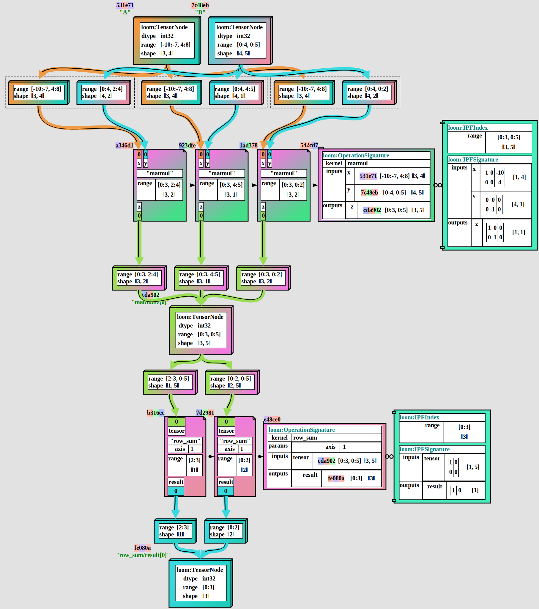

# loom: tensor tapestry compiler

**loom** is an experimental optimizing tensor expression compiler.

The goal of **loom** is to provide an ecosystem for a high-performance stochastic pareto-front optimizer
for distributed tensor expressions, targeting optimizations which are permitted to search for extended
time on a large number of machines.

Many modern tensor expressions may see 10k GPU-**years** of computation time over their lifetime, such as
a trained inference model hosted in production; and seeking optimizations which can reduce this
computation time by any extent is worth extensive optimization search.

It is built in several layers:
 * an in-memory, GPU-free **Z**-space tensor math library.  
   This provides a framework for reasoning about polyhedral types, coordinate-space ranges,
   and index projection functions.
 * an extensible, JSON serializable **IR** (intermediate representation) for tensor expressions.
   This provides a framework for reasoning about tensor expressions, and for applying
   transformations to them.
 * an extensible validation stack for **IR** expressions.  
   This provides a framework for reasoning about the correctness of tensor expressions.

In the current stage of development, **loom** is a research prototype. It lacks many features,
including code generation and optimization machinery.

See the [Tapestry Project Writeup](https://crutcher.github.io/Tapestry/) for a more detailed
overview of the theory and goals of **loom**. Note, this document predates much of the current
development, and is more of a research direction plan and overview of polyhedral optimization
theory.

## Development Philosophy

The **loom** values are, in order of precedence:

1. **readability** - it should be easy to understand what the code is doing.
2. **verifiability** - as much behavior as possible should be mechanically verifiable.
3. **visibility** - it should be easy to visualize what the code is doing.
4. **velocity** - it should be easy to add new features.
5. **extensibility** - it should be easy to add new features as plugins.
6. **correctness** - the algorithms should be correct.
7. **speed** - the algorithms should be fast.
8. **completeness** - the algorithms should be complete.

As the target for **loom** is a high-throughput stochastic pareto-front optimizer; speed and
correctness are critically important; and that is why **loom** is built in a compiled language.

However, **speed** and **correctness** are **products** of the ability of researchers and developers
to understand, verify, visualize, and extend the code.

## Getting Started

In the current stage of development, **loom** produces no tool targets; and exists solely as a
collection of libraries and tests.