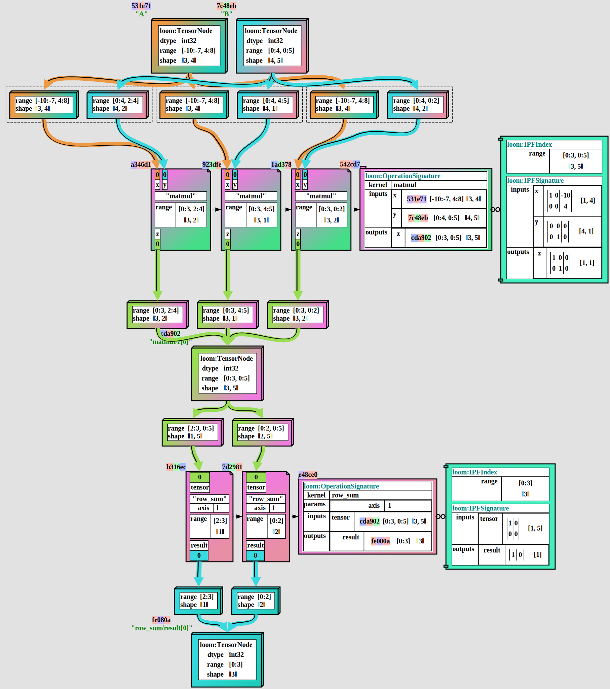

# Tapestry Compiler Suite

**Tapestry** is an experimental optimizing tensor expression compiler suite.

The goal of **Tapestry** is to provide an ecosystem for a high-performance stochastic pareto-front
optimizer for distributed tensor expressions, targeting optimizations which are permitted to search
for extended time on a large number of machines.

Many modern tensor expressions may see 10k GPU-**years** of computation time over their lifetime,
such as a trained inference model hosted in production; and seeking optimizations which can reduce
this computation time by any extent is worth extensive optimization search.

It is built in several layers:

- an in-memory, GPU-free **Z**-space tensor math library. This provides a framework for reasoning
  about polyhedral types, coordinate-space ranges, and index projection functions.
- an extensible, JSON serializable **IR** (intermediate representation) for tensor expressions. This
  provides a framework for reasoning about tensor expressions, and for applying transformations to
  them.
- an extensible validation stack for **IR** expressions. This provides a framework for reasoning
  about the correctness of tensor expressions.

In the current stage of development, **Tapestry** is a research prototype. It lacks many features,
including code generation and optimization machinery.

See the [Tapestry Project Writeup](https://crutcher.github.io/Tapestry/) for a more detailed
overview of the theory and goals of **loom**. Note, this document predates much of the current
development, and is more of a research direction plan and overview of polyhedral optimization
theory.

## Sub-Projects

- **[ZSpace](tensortapestry-zspace/README.md)** - integer space (Z-space) tensors.
- **[loom](tensortapestry-loom/README.md)** - tensor expression graph representation.
- **[weft](tensortapestry-weft/README.md)** - metakernel symbolic execution api.

## Development Philosophy

The **Tapestry** values are, in order of precedence:

1. **long term velocity** - the ability to add new features and fix bugs over the long term.
   - **clean apis** - every layer of the apis should be easy to understand and extend.
   - **clean tests** - the readability and extendability of the tests should be a priority.
   - **documentation** - all behavior should be documented.
2. **clean theory** - the mechanics being modeled should be consistent and correct.
   - **no escape hatches** - the behavior models should not have catch-all escape hatches.
3. **speed** - the algorithms should be fast.
4. **extensibility** - the ability to add new features.
   - **plugins** - as much behavior as possible should be implemented as plugins.
5. **usefulness** - the ability to solve real-world problems.

As the target for **Tapestry** is a high-throughput stochastic pareto-front optimizer; speed and
correctness are critically important; and that is why **Tapestry** is built in a compiled language.

However, **speed** and **correctness** are **products** of the ability of researchers and developers
to understand, verify, visualize, and extend the code.

**Usefulness** is the last on the list. This represents a focus on the long-term internal velocity
and correctness of tapestry over short-term feature velocity of applications.

## Getting Started

In the current stage of development, **loom** produces no tool targets; and exists solely as a
collection of libraries and tests.

## Active Work Surfaces

- [Metakernel Template Language Design](https://github.com/crutcher/loom/issues/2)
- [Loom Type URI Schema](https://github.com/crutcher/loom/issues/3)
- [Launch Project Domain](https://github.com/crutcher/loom/issues/4)
- [Setup Maven Packages](https://github.com/crutcher/loom/issues/5)
