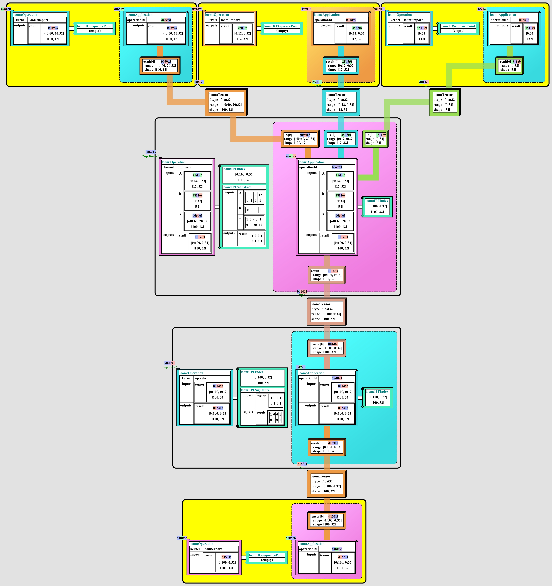
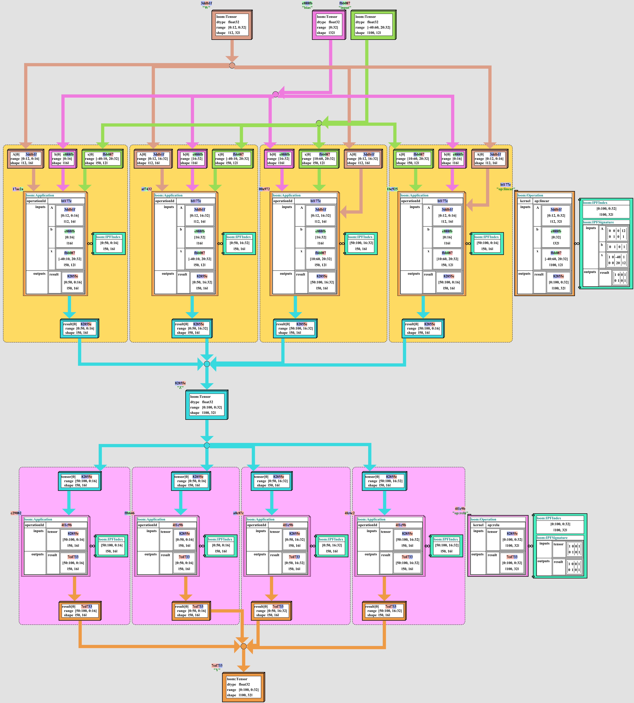
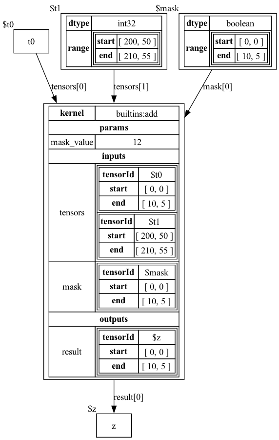

# Tensor Tapestry Compiler Suite

See the full [Tapestry Documentation](docs/README.md) for detailed information.

**Tapestry** is an experimental tensor expression optimizing compiler suite.

It exists to make it easy to optimize applications (such as AI) to maximally exploit both
datacenters full of GPUs, and integrated FPGA stacks.

The goal of **Tapestry** is to provide an ecosystem for a high-performance stochastic pareto-front
optimizer for distributed tensor expressions, targeting optimizations which are permitted to search
for extended time on a large number of machines.

Here are examples showing a **Linear**/**ReLU** pipeline, with and without sub-block sharding;
demonstrating the potential for sub-shard operation fusion:

<table cellborder="0">
  <tr>
    <td>
      

        
      

    </td>
    <td>
      

        
      

    </td>
  </tr>
</table>

## Contributing

I'm actively looking for contributors to help with building or reviewing the project.

If you'd like to get involved, please post any questions in the project
[Discussions](https://github.com/crutcher/loom/discussions) board, or open an issue.

We could create a Discord server; if we got enough traction.

I'm particularly interested in contributors with experience in the following areas:

- maven lifecycle / package publishing
- technical documentation / editing
- compiler design
- tensor algebra
- optimization theory
- graph transformations
- graph representation
- distributed computing
- graph visualization

## Getting Started

In the current stage of development, **loom** produces no tool targets; and exists solely as a
collection of libraries and tests.

It **should** setup cleanly in any modern development environment; but full external dependencies
are not yet documented.

Documenting missing dependencies is a high priority and setup instructions is another high priority
which contributors could help with.

## Dialects

Tapestry is structured with a modular graph system.

A given graph is attached to a _LoomEnvironment_, which defines the legal node and tag types used in
the graph; along with a collection of constraints and rules for the graph.

In this way, dialects focused on different aspects of the tool chain can be developed and remain
strictly defined, while sharing common scan and validation tooling.

### Operation Expression Dialect

The [Operation Expression Dialect](docs/dialects/OperationExpressionDialect.md) is a dialect for
representing un-sharded operations and tensors in a graph.

### Application Expression Dialect

The [Application Expression Dialect](docs/dialects/ApplicationExpressionDialect.md) is a dialect for
representing application sharded operations and tensors in a graph.

It extends the [Operation Expression Dialect](docs/dialects/OperationExpressionDialect.md) to
include Application shards, and constraints for application sharded operations.

