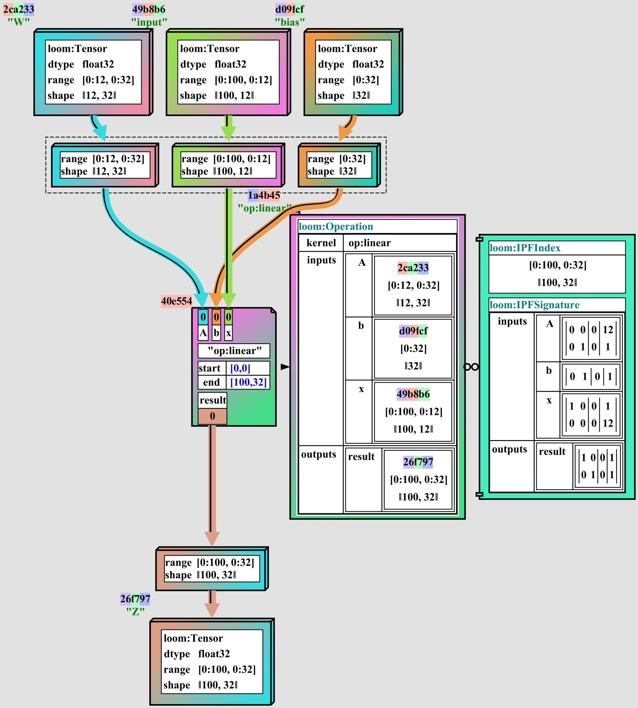
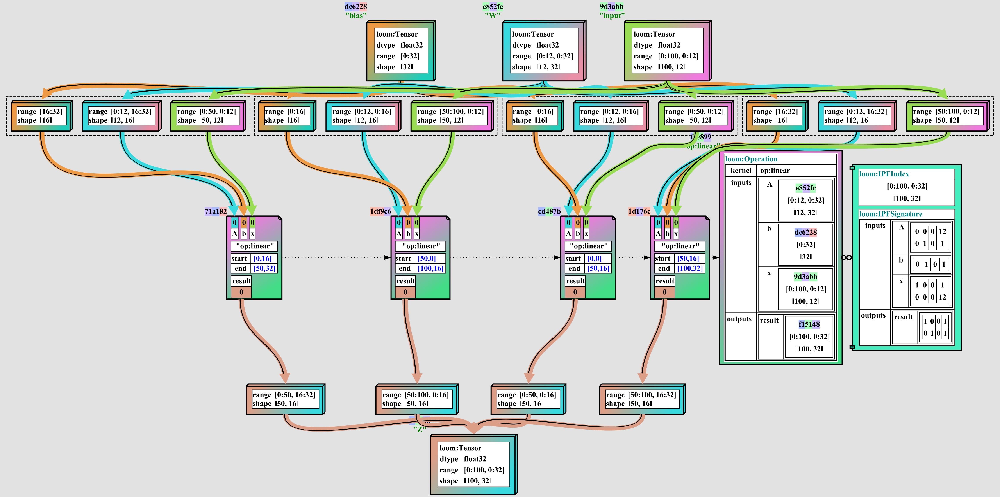

# Tensor Tapestry Compiler Suite

**Tapestry** is an experimental tensor expression optimizing compiler suite.

See the [Tapestry Documentation](docs/README.md) for more information.

The goal of **Tapestry** is to provide an ecosystem for a high-performance stochastic pareto-front
optimizer for distributed tensor expressions, targeting optimizations which are permitted to search
for extended time on a large number of machines.

Here is in an example of the same _Linear_ operation, with and without sub-block sharding:

## Getting Started

In the current stage of development, **loom** produces no tool targets; and exists solely as a
collection of libraries and tests.

It **should** setup cleanly in any modern development environment; but full external dependencies
are not yet documented.

## Active Work Surfaces

- [Metakernel Template Language Design](https://github.com/crutcher/loom/issues/2)
- [Loom Type URI Schema](https://github.com/crutcher/loom/issues/3)
- [Launch Project Domain](https://github.com/crutcher/loom/issues/4)
- [Setup Maven Packages](https://github.com/crutcher/loom/issues/5)
