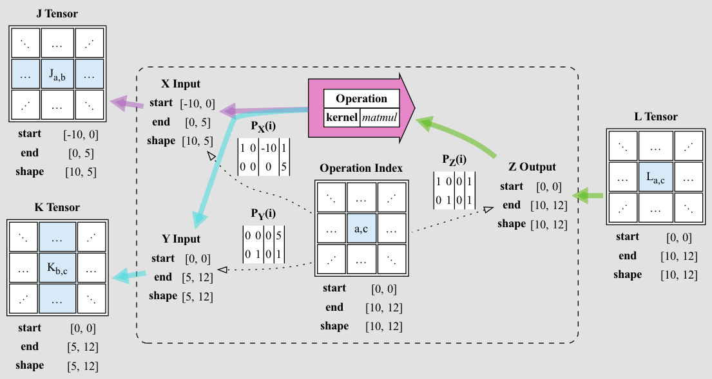

# Polyhedral Type Signatures

This document describes the semantics of _Polyhedral Type Signatures_ as used in _Tapestry_.

## Background

The [Polyhedral / Polytope Model](https://en.wikipedia.org/wiki/Polyhedral_model) is a mathematical
model for representing and reasoning about finite index sets and their associated iteration spaces.

## Introduction

A **Tensor Block Expression Operation** is a tensor expression operation which defines some number
of tensor outputs in terms of some number of tensor inputs; in a form which can be sharded and
distributed.

Consider the following example, in which an operator defines two output tensors `X` and `Y`, in
terms of two input tensors `A` and `B`. For this to be a _block_ operation, it must be possible to
shard the application of this operation along some sharding of the input and output tensors.

<table style="border: 0">
  <tr>
    <td>
      <div style="width: 100%; margin: auto">
        
      </div>
    </td>
    <td>
      <div style="width: 100%; margin: auto">
        
      </div>
    </td>
  </tr>
</table>

A **Polyhedral Type Signature** defines the way an operation's inputs and outputs co-range under
sharding.

> **Note**: While many tensor block operations, and composites of tensor block operations can be
> sharded in a way which is consistent with the Polyhedral Model, this is not universally the case.
> Operations which cannot can be described by a trivial projection signature, but they will not be
> able to be sharded.

A **Polyhedral Type Signature** has:

- On **Operation Index Space**, a finite n-dimensional **Z**-space of integer coordinates; where
  each point in the space corresponds to a minimal block application of the operation.
- A collection of **Index Projection Maps** from the **Operation Index Space** to the **Tensor Index
  Space**, for each input and output tensor; defining the way a point in the index space maps to a
  region of the tensor coordinate space.

An **Operation** annotated with a **Polyhedral Type Signature** must also be annotated with an
**Operation Index** in the **Operation Index Space**; this index defines the scope of the operation
as projected through the **Index Projection Maps**.

The **Operation** must also be able to index sub-regions of the input and output tensors, and so the
inputs and outputs must be annotated with **Selection Ranges**; where each range is a pair of points
in the tensor coordinate space, defining a sub-box of the tensor.

Extending and generalizing the idea of **Selection Ranges**; we can say that every logical tensor
has a K-dimensional block range; but that range may **not** start at the origin of the tensor
coordinate space. So a tensor defined as ranging from `[-100, -100, 0]` to `[10, 10, 10]` would be
well-defined and have shape `[110, 110, 10]`; and any referencing **selection range** would be
required to be a sub-box of this range.

Each **Index Projection Map** is defined as affine projection from the **Operation Index Space** to
the **Tensor Index Space** of that tensor. The maps are defined as a matrix and vector pair which
define the affine transformation; and as a result they are linear in both the **Operation Index
Space** and the **Tensor Index Space**.

An additional requirement placed upon the output maps is that they must be injective; that is, they
must not map two different points in the **Operation Index Space** to the same point in the **Tensor
Index Space**. This is a requirement for the operation to be sharded.

One result of the linearity of the index projection maps is that coherent sub-boxes of the
**Operation Index Space** are projected to coherent sub-boxes of each of the **Tensor Index Space**;
which is to say that sharding produces connected local neighborhoods of the input and output
tensors.

The tensor selection map ranges must be equal to the selection ranges which would result from
applying the entire **Operation Index Space** to the tensor index projection maps; this is a
requirement for the operation to be well-defined. Each sub-shard of the operation will maintain this
property.

Making this more concrete:

- **Operation**
  - **kernel** - the id of whatever kernel is being applied by the operation.
  - **parameters** - the non-tensor parameters to the operation's kernel.
  - **inputs** / **outputs**
    - _{name}_:
      - **Tensor Reference** (K-dimensional)
      - **Selection Range**
        - **start** - inclusive k-dim point in the tensor coordinate space
        - **end** - exclusive k-dim point in the tensor coordinate space
  - **Operation Index** (P-dimensional)
    - **start** - inclusive P-dim point in the tensor coordinate space
    - **end** - exclusive P-dim point in the tensor coordinate space
  - **Polyhedral Type Signature** (P-dimensional)
    - **inputs** / **outputs**
      - _{name}_:
        - **Index Projection Map** (P-dimensional to K-dimensional)
          - **PxK Matrix**
          - **K-dim Offset Vector**
          - **K-dim Projection Shape**

## Example: Matmul

Consider an abstract 2-D tensor `matmul` matrix multiplication operator; which takes two 2-D named
parameters `X` and `Y`, and produces a 2-D named result `Z`; and takes no other non-tensor
parameters.

Let there be two tensors:

- `J` - `[10, 5]`
  - `start` - `[-10, 0]`
  - `end` - `[0, 5]`
- `K` - `[5, 12]`
  - `start` - `[0, 0]`
  - `end` - `[5, 12]`

We wish to apply `matmul` to these tensors to produce a third tensor `L`:

- `L` - `[10, 12]`
  - `start` - `[0, 0]`
  - `end` - `[10, 12]`

As `matmul` performs a cell-wise multiplication of the rows of `X` and the columns of `Y`, and the
sums the results; the minimal unit of work for this operation must include an entire row of `X` and
an entire column of `Y`; but the operation is shardable on `A` and `C`.

### Operation Index Space

So for this operation, we can define an **Operation Index** `I` over (`AxB`) as `[0, 0]` to
`[10, 12]`.

### `X` Index Projection

The minimal unit of work for the `X` parameter is a row in `X`, and so we can define an index
projection for `X` as:

- **Matrix**:
  - `[1, 0]`
  - `[0, 0]`
- **Offset**: `[0, 0]`
- **Shape**: `[1, 5]`

This will select a `[1, 5]` sub-box of `X` for each point in the index space. It is worth noting
that all points with the same `A` in index space will select the same row in `X` space.

### `Y` Index Projection

The minimal unit of work for the `Y` parameter is a column in `Y`, and so we can define an index
projection for `Y` as:

- **Matrix**:
  - `[0, 0]`
  - `[0, 1]`
- **Offset**: `[0, 0]`
- **Shape**: `[5, 1]`

This will select a `[5, 1]` sub-box of `Y` for each point in the index space. It is worth noting
that all points with the same `C` in index space will select the same column in `Y` space.

### `Z` Index Projection

Each point in the index space will select a `[1, 1]` sub-box of `Z` space; and so we can define an
index projection for `Z` as:

- **Matrix**:
  - `[1, 0]`
  - `[0, 1]`
- **Offset**: `[0, 0]`
- **Shape**: `[1, 1]`

### Concrete Example

Making this concrete:

<details>
<summary>Expand for YAML</summary>

```yaml
tensors:
  J:
    start: [-10, 0]
    end: [0, 5]
  K:
    start: [0, 0]
    end: [5, 12]
  L:
    start: [0, 0]
    end: [10, 12]

operation:
  kernel: matmul
  inputs:
    X:
      tensor: $J
      range:
        start: [-10, 0]
        end: [0, 5]
    Y:
      tensor: $K
      range:
        start: [0, 0]
        end: [5, 12]
  outputs:
    Z:
      tensor: $L
      range:
        start: [0, 0]
        end: [10, 12]
  index:
    start: [0, 0]
    end: [10, 12]
  signature:
    inputs:
      X:
        matrix:
          - [1, 0]
          - [0, 0]
        offset: [0, 0]
        shape: [1, 5]
      Y:
        matrix:
          - [0, 0]
          - [0, 1]
        offset: [0, 0]
        shape: [5, 1]
    outputs:
      C:
        matrix:
          - [1, 0]
          - [0, 1]
        offset: [0, 0]
        shape: [10, 12]
```

</details>



> **Note**: here we are using doubly-augmented matrix notation; where the projection matrix is
> augmented with an offset vector, and a shape vector.
>
> So that this:
>
> <table>
>   <tr><td>1</td><td>0</td><td>-10</td><td>1</td></tr>
>   <tr><td>0</td><td>0</td><td>0</td><td>5</td></tr>
> </table>
>
> Is equivalent to this:
>
> ```yaml
> matrix:
>   - [1, 0]
>   - [0, 0]
> offset: [-10, 0]
> shape: [1, 5]
> ```
