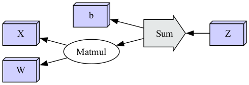

# Polyhedral Types and Index Projection

## Background Reading

[Polyhedral types](https://en.wikipedia.org/wiki/Polyhedral_model) are a way to represent the iteration space of
a loop nest. They are used in the context of polyhedral compilation to represent the iteration space of a loop nest
as a polyhedron, and to represent the access patterns of array references as a set of affine functions.

## Introduction

**Polyhedral Types**, **Polytrope Types**, **the polytrope model**, and **index projection functions** are
all ways of talking about complex iteration spaces restricted to permit affine transformations of the index
space. These are used in the context of polyhedral compilation to represent the iteration space of a loop nest
as a polyhedron, and to represent the access patterns of array references as a set of affine functions.

There is a strong alignment between multidimensional tensor operations and the polyhedral model.

Consider a small tensor expression in a toy language (**Expr**) of block operations, motivated by a fully connected
neural network layer:

```
X, W, b, Z: Tensor
Z = Linear(X, W, b)
Y = ReLU(Z)
```

At this point there are no formal semantics for **Expr**; we're searching design space
for formal semantics such that:

1. Common operations in AI can be represented in the semantics;
2. $Expr$ can be sharded to a distributed GPU fabric using existing optimization theory.

Consider one functional dependency interpretation of our toy example:


Taking motivation from the toy example; we'd like to be able to shard the **Linear** node.
The operation is intended as a stand-in for the fully-connected linear layer operation from
neural networks:

```math
\begin{eqnarray*}
Linear(X_{[batch,in]}, W_{[in,out]}, b_{[out]}) := X \times W + b
\end{eqnarray*}
```

By examining the implementation of **Linear**, and assuming that **X** has shape **[batch, in]**,
we can show that the operation can be cleanly sharded along any batch dimensions of the input **X**:

```math
\begin{eqnarray*}
\left\{ \begin{split}
Z &= Linear(X, W, b) \\
Y &= ReLU(Z)
\end{split} \right\}
%
& \rightarrow_{shard(X)} &
%
\left\{ \begin{split}
Z &= \left( \begin{split}
Linear_1(X[..k , ...], W, b) \\
Linear_2(X[k.. , ...], W, b)
\end{split} \right) \\
Y &= ReLU(Z)
\end{split} \right\} \\ \\
%
&\rightarrow_{shard(Z)}& \quad
%
\left\{ \begin{split}
X_1 &= X[.. k, ...] \\
X_2 &= X[k .., ...] \\
Z_1 &= Linear_1(X_1, W, b) \\
Z_2 &= Linear_2(X_2, W, b) \\
Z &= \left( \begin{split}
Z_1 \\
Z_2
\end{split} \right) \\
Y &= ReLU(Z)
\end{split} \right\}
\end{eqnarray*}
```


By exploiting our knowledge of the implementation of $ReLU$:

```math
\begin{eqnarray*}
ReLU(Z) := Z \circ [Z > 0]
\end{eqnarray*}
```

> 📝 Note: While many activation functions are more complex, ReLU specifically
> can be rewritten, by the above definition, as a `where(T, T, zeros_like(T))` selection expression.
>
> This is distracting from the current derivation, but in practice
> could provide significant speedups; depending upon implementation and fusion pragmatics.

We know that we can also re-write $ReLU$ expressions upon the batch dimensions:

```math
\begin{eqnarray*}
\left\{ \begin{split}
X_1 &= X[.. k, ...] \\
X_2 &= X[k .., ...] \\
Z_1 &= Linear_1(X_1, W, b) \\
Z_2 &= Linear_2(X_2, W, b) \\
Z &= \left( \begin{split} Z_1 \\ Z_2 \end{split} \right) \\
Y &= ReLU(Z)
\end{split} \right\}
%
& \rightarrow_{forward(Z)} &
%
\left\{ \begin{split}
X_1 &= X[.. k, ...] \\
X_2 &= X[k .., ...] \\
Z_1 &= Linear_1(X_1, W, b) \\
Z_2 &= Linear_2(X_2, W, b) \\
Y &= \left( \begin{split}
ReLU_1(Z_1) \\
ReLU_2(Z_2)
\end{split} \right)
\end{split} \right\} \\ \\
%
& \rightarrow_{shard(Y)} &
%
\left\{ \begin{split}
X_1 &= X[.. k, ...] \\
X_2 &= X[k .., ...] \\
Z_1 &= Linear_1(X_1, W, b) \\
Z_2 &= Linear_2(X_2, W, b) \\
Y_1 &= ReLU_1(Z_1) \\
Y_2 &= ReLU_2(Z_2) \\
Y &= \left( \begin{split}
Y_1 \\
Y_2
\end{split} \right) \\
\end{split} \right\}
\end{eqnarray*}
```


And finally, seeing $Z_1$ and $Z_2$ do not escape, we can fuse $Linear$ and $ReLU$
into the combined $Linear \Rightarrow ReLU$ operation, and collapse the shards:

```math
\begin{eqnarray*}
\left\{ \begin{split}
X_1 &= X[.. k, ...] \\
X_2 &= X[k .., ...] \\
Z_1 &= Linear_1(X_1, W, b) \\
Z_2 &= Linear_2(X_2, W, b) \\
Y_1 &= ReLU_1(Z_1) \\
Y_2 &= ReLU_2(Z_2) \\
Y &= \left( \begin{split}
Y_1 \\
Y_2
\end{split} \right)
\end{split} \right\}
%
& \rightarrow_{compose(Linear, ReLU)} &
%
\left\{ \begin{split}
X_1 &= X[.. k, ...] \\
X_2 &= X[k .., ...] \\
Y_1 &= ReLU_1(Linear_1(X_1, W, B)) \\
Y_2 &= ReLU_2(Linear_2(X_2, W, B)) \\
Y &= \left( \begin{split}
Y_1 \\
Y_2
\end{split} \right)
\end{split} \right\} \\ \\
%
& \rightarrow_{fuse(Linear, ReLU)} &
%
\left\{ \begin{split}
X_1 &= X[.. k, ...] \\
X_2 &= X[k .., ...] \\
Y_1 &= (Linear \Rightarrow ReLU)_1(X_1, W, b) \\
Y_2 &= (Linear \Rightarrow ReLU)_2(X_2, W, b) \\
Y &= \left( \begin{split}
Y_1 \\
Y_2
\end{split} \right)
\end{split} \right\} \\ \\
\end{eqnarray*}
```


These series of transformations are possible because we know (or assume) details about
the structural coupled ranging of the inputs and outputs to the operations $Linear$ and $ReLU$.

### Restricting to Shardable Operators

We cannot assume that any arbitrary operation from a collection of named tensors (the parameters)
to a collection of named tensors (the results) will have cleanly explicable structural coupled
ranging
(the relationship between the data in the input cells and the data in the output cells);
but we can observe that the tractability and explicability of the structural coupled ranging of
operators
bears directly upon our ability to design mechanical sharding and graph-rewrite algorithms over
expression graphs.

* If we take as a design requirement the ability to make intelligent sharding choices about
  operators,
  and to be able to chain the results of those choices through subsequent layers of the graph, then
  we
  can reframe the semantics problem of our toy language as searching for a family of operators with
  this property.

For any given $Operator$, we need additional information:

* Given the shapes of the parameters, what are the expected shapes of the results?
* Given the shapes of the parameters, what independent shards are possible which can be
  fused back into the same results?
* How do the shards share resources (which sharding choices are more or less expensive)?

Recall the toy tensor expression in $Expr$:

```
X, W, b, Z: Tensor
Z = Linear(X, W, b)
Y = ReLU(Z)
```


Let $Operator$ be a block-operation, taking *tensor*-valued inputs, and producing *tensor*-valued
outputs.

As discussed previously, we're attempting to find a family of $Operators$ such that,
for any given $Operator$, we'll have additional information:

* Given the shapes of the parameters, what are the expected shapes of the results?
* Given the shapes of the parameters, what independent shards are possible which can be
  fused back into the same results?
* How do the shards share resources (which sharding choices are more or less expensive)?


Consider the abstract one-$Operator$ expression graph:


We're interested in families of $Operator$ such that we can shard operations mechanically, and
re-assemble the results mechanically, and produce the same value as though the operation had been
done in one pass.


### Operator Index Counting

Crucially, the goal is to be able to shard:

* *With* a strong ability to predict execution costs before evaluation; and
* *Without* examining anything about the implementation of $Operator$.

This can be re-framed as a counting problem:

* Can we enumerate all simple sub-problems of a given call to $Operator$?

To make this concrete, let's reconsider $Linear$ from above. If we add an $index$ space
to count all sub-problems of $Linear$:

* What is the shape of $index$?
    * How many dimensions does $index$ have?
    * What are their sizes?
* What relationship does the shape of $index$ have to the inputs ($X$, $W$, $b$) and outputs ($Y$)?
* What *portions* of the inputs and outputs are associated with each point in $index$?


Given a block $Operation$, and knowledge about the structural coupled ranging of its inputs
and outputs, we seek an index space, and a collection of projection functions $P_T(i)$
for each input or output $tensor$, such that we can mechanically enumerate sub-problems
and re-assemble the results.

It is important to state that the top-down approach (starting with an $Operator$, find sharding)
is a potentially intractable problem; while the bottom-up approach (starting with sharding, define
$Operator$s) is solvable by construction (but limited to findable constructions):

* Top-Down: Given this $Operator$, can I find projection functions $P_T(i)$?
* Bottom-Up: Given a menagerie of known projection functions $P_T(i)$,
  what $Operators$ can I construct?

### Index Projection Functions

One design approach for solving the $P_T(i)$ projection design problem is the use of
discrete coordinate space (integer, $\mathbb{Z}$) affine transforms (linear projections) from the
index space
to the tensor spaces.

Discrete affine projection functions are a common approach that's also been incorporated into
the [MLIR](https://mlir.llvm.org/)
project's [Polyhedral Types](https://mlir.llvm.org/docs/Dialects/Affine/).

What components make up an affine index projection function?:

* The projections are Z-Space / integer valued;
* an affine expression mapping points in $index$ space to starts in the coordinate space of
  input/output tensors;
* a fixed $shape$ defining the shape of region selected relative to the mapped point.

The simplest representation of this is a simple affine transform + a shape:

```math
\begin{eqnarray*}
P_T(i) := ZRange(start: A_T i + B_T, shape: S_T)
\end{eqnarray*}
```

Are affine expressions the *right* or *best* solution to te design of projection functions?
We don't know; affine expressions can only be compared to other proposals, not
all possible families of functions; there may be better ideas yet to be surfaced.
We do know that affine expressions make some common patterns easy to express
*and* to compute the shards of; and make some performance critical patterns
*tractable* to express and compute the shards of.

Affine projection function have an important non-obvious property; it is generally
tractable to arrange them such that *coherent* range blocks in the *index* space
map to *coherent* space blocks in the input or output tensors. This property falls
out of the fact that affine projection functions have constant marginal delta strides
(the incremental change resulting from changing an input by one step is constant).
Coherent input/output blocks dramatically simplify processing expectations,
particularly in the face of shared input (as with convolution operations).

As with many matrix transform operations, the basic definitions are simple;
but some of the implications can be complex to unpack. We'll explore a few here.

#### Linear Strides Over a Batch Dimension

Consider $Linear$ again:

```math
\begin{eqnarray*}
Linear(X_{[batch,in]}, W_{[in,out]}, b_{[out]}) := X \times W + b
\end{eqnarray*}
```

In order to discuss projection functions, we need to extract the dimensions
of the tensors under discussion; let's assume
$X: [batch, in]$, $W: [in, out]$, $b: [out]$, $Y: [batch, out]$:

> 📝 Note: Careful readers may note that while $W$ and $b$ are frequently tied to a model
(and thus have a fixed size); $batch$ could be a stand-in not only for an
> arbitrarily sized input $X$ (and thus an arbitrarily sized output $Y$);
> but that we could model it as having an arbitrary number of dimensions; the
> math of which are simple extensions.


We'd like to be able to describe a $P_X(i)$ affine projection such that we can describe
the following shards:


It's clear that $P_W(i)$ and $P_b(i)$ can ignore $batch$ dimensional sharding; and it seems
simple linear projections are sufficient to describe the $start$ points of $P_X(i)$ and $P_Y(i)$
in terms of the indexed $batch$ dimension, and the shapes in terms of the total $in$ and $out$
shapes.

```math
\begin{eqnarray*}
P_X(i) &=& ZRange \left\{ \begin{split} start&:& [i_{batch}, 0], \\ shape &:& [1, X_{in}]
\end{split} \right\} \\
\\
P_Y(i) &=& ZRange \left\{ \begin{split} start&:& [i_{batch}, 0], \\ shape &:& [1, Y_{out}]
\end{split} \right\}
\end{eqnarray*}
```


We also cleanly get the property that coherent ranges in the index space
correspond to coherent tensor ranges in the mapped coordinate space:


#### Sharding Linear over the out dimension

```math
\begin{eqnarray*}
Linear(X, W, b) := X \times W + b
\end{eqnarray*}
```

We'll now consider the projection functions $P_W(i)$, $P_b(i)$, and $P_Y(i)$;
and how we'll handle batching over `out` dimensions:


The values of $Linear$ in the `out` dimension are independent of each other;
each `out` value is computed using one column of $W$ and one value in $b$;
and as a result the op can be cleanly and trivially sharded by chunking $W$ and $b$,
and reconstituting the result via selection expressions:


By extending the $index$ space to index the $out$ dimension, we can express the index functions
$P_W(i)$, $P_b(i)$,
and $P_Y(i)$ $start$ coordinates in terms of the indexed $out$ coordinate, and the shapes in
terms of the $W_{out}$ out dimension size.

```math
\begin{eqnarray*}
P_W(i) &=& ZRange \left\{ \begin{split} start&:& [0, i_{out}], \\ shape &:& [W_{out}, 1]
\end{split} \right\} \\
\\
P_b(i) &=& ZRange \left\{ \begin{split} start&:& [i_{out}], \\ shape &:& [1] \end{split}
\right\} \\
\\
P_Y(i) &=& ZRange \left\{ \begin{split} start&:& [0, i_{out}], \\ shape &:& [W_{out}, 1]
\end{split} \right\}
\end{eqnarray*}
```


We also cleanly get the property that coherent ranges in the index space
correspond to coherent tensor ranges in the mapped coordinate space:


### Sharding Linear, and Matmul, over the in dimension

Previously we developed affine projection sharding over the $batch$ and $out$ dimensions of a
tensor-valued $Linear$
operation, assuming dimensions: $X: [batch, in]$, $W: [in, out]$, $b: [out]$, $Y: [batch, out]$:

```math
\begin{eqnarray*}
Linear(X_{[batch,in]}, W_{[in,out]}, b_{[out]})_{[batch,out]} := X \times W + b
\end{eqnarray*}
```

To examine sharding over the $in$ dimension, we'll need to focus on the nature of the matrix
multiplication
operation, and discuss $Matmul$ and $Sum$ operations.

```math
\begin{eqnarray*}
Matmul(X_{[batch,in]}, W_{[in,out]})_{[batch,out]} &:=& X \times W \\
Sum(A\_{[...]}, B\_{[...]})\_{[...]} &:=& A + B
\end{eqnarray*}
```

What's important here is that, while $Matmul$ is linearly shardable in its $batch$ and $out$
dimensions,
it contains an implicit reduce sum reduction operation in its $input$ dimension.

```math
\begin{eqnarray*}
Matmul(X_{[batch,in]}, W_{[in,out]}) := \left(
\begin{split}
\left\{\sum_{in=1}^n x_{batch,in}w_{in,out}\right\}_{batch,out} &\qquad& ... \\
... &\qquad& ...
\end{split} \right)
\end{eqnarray*}
```

> 📝 Note: careful readers may note that there exists a large body of work dedicated to the question
> of
> how to implement $Matmul$ more efficiently. The point of this exercise is to use $Linear$ and
> $Matmul$
> as a lens to examine data coupled ranging in sharding block operations; and a naive treatment of
> $Matmul$
> is useful to these needs.
> \
> In a fully developed tensor expression sharding environment, it could be useful to hoist some
> operations, such as $Matmul$ to the level that the compiler were directly aware of them;
> and could more aggressively use the existing research in those spaces; but it is not
> necessary to develop the foundations of such an environment.

Returning to $Linear$, we can rewrite $Linear$ as a composition of $Matmul$ and $Sum$:

```math
\begin{eqnarray*}
Linear(X_{[batch,in]}, W_{[in,out]}, b_{[out]})_{[batch,out]} := Sum(Matuml(X, W), b)
\end{eqnarray*}
```

Applying this re-write would restructure our expression graph from this:


To this:



A block operation sharding solution for $Matmul$ on $in$ should translate to a solution
for $Linear$ on $in$.

We can decompose $Matmul$ by distinguishing between the matrix multiplication operator ($\times$)
and the cell-wise product operation ($\cdot$); and generate an intermediate product with
shape $[batch,in,out]$.

To do this, we need to extend and broadcast $X$ and $W$ to the combined shape $[batch,in,out]$,
to produce an intermediate result $V$:

```math
\begin{eqnarray*}
V := (X\_{[batch,in,1]} \cdot W\_{[1,in,out]})\_{[batch,in,out]}
\end{eqnarray*}
```

And we need to introduce a new operator $SumDim(T, dim)$ which sums along and removes one dim of
$T$.

We can now define $Matmul$ in terms of this intermediate result, and $SumDim$

```math
\begin{eqnarray*}
Matmul(X_{[batch,in]}, W_{[in,out]})_{[batch,out]} &:=& X\_{[batch,in]} \times W\_{[in,out]\} \\
&=& SumDim \left( \begin{split}
(X\_{[batch,in,1]} \times W\_{[1,in,out]})\_{[batch,in,out]}, \\
dim = \langle in \rangle
\end{split} \right)
\end{eqnarray*}
```

This decomposition yields the following expression graph:


In this decomposition, $Prod$ is a well-behaved block operation; but
$SumDim$ is represented differently, it is not a block operation as we've represented them
before, but a *reduction operation*.

#### Sharding Prod

Consider $Prod$; a simple cell-wise multiplication. We expect the output
to have the same shape and dimensions as the input:

```math
\begin{eqnarray*}
Prod(A\_{[...]\}, B\_{[...]})\_{[...]} &:=& A \cdot B \\
Prod(A\_{[m,n,o]}, B\_{[m,n,o]})\_{[m,n,o]} &:=& \left( \begin{split}
(a\_{m,n,o} \cdot b\_{m,n,o}) &\qquad& ... \\
... &\qquad& ...
\end{split} \right)
\end{eqnarray*}
```

To achieve this in tensor operations over inputs where the shapes are not initially the
same, but can be manipulated to be the same; it's common to use *broadcasting*; to
treat any dimension which is $1$ for one input, but non $1$ for another input
as though it were broadcast or spread to cover the size of the other:

```math
\begin{eqnarray*}
Prod(A\_{[1,n,o]}, B\_{[m,1,o]})\_{[m,n,o]} := \left( \begin{split}
(a\_{1,n,o} \cdot b\_{m,1,o}) &\qquad& ... \\
... &\qquad& ...
\end{split} \right)
\end{eqnarray*}
```

It is also common in tensor operations to perform various permutations,
transpositions, and reversals to achieve appropriate alignment for
broadcasting operations; all tensor libraries have a host of features,
some more convenient than others.

```python
import torch
batch = 10
input = 2
output = 3

x = torch.rand((batch, input)
x.shape
# torch.Size([10, 2]))

x.unsqueeze(-1).shape
# torch.Size([10, 2, 1])

w = torch.rand((input, output))
w.shape
# torch.Size([2, 3]))

w.unsqueeze(0).shape
# torch.Size([1, 2, 3])

(x.unsqueeze(-1) * w.unsqueeze(0)).shape
# torch.Size([10, 2, 3])
```

Index projection functions permit working directly in the dimensions
of the input and output tensors; provided there is enough space in
the dimensionality of the index space to count all points in the block;
so we can directly describe the above $Prod$ operation used by the $Matmul$
with a simple index space that covers the full shape of the output.


> 📝 Note: careful readers may note that this involves the same input
> data being read by multiple output cells.

#### Reduction Operations

Reduction operations require information *between* cells, on the face they
don't appear shardable. Consider the index projections for a
$SumDim(X\_{[batch,reduce]}, dim=\langle reduce \rangle)$ operation
over two dimensions:


$SumDim$, as a block operation, cannot be sharded along the $reduce$ dimension.

Additional information about $SumDim$, and about rewrites to $SumDim$
which are semantics-preserving; beyond what can be expressed about *Block Operators*,
would permit us to break it apart.

In modeling tensor expression graphs, we're interested in recurrent *classes* of operations;
a solution specific to $SumDim$ might be useful, but a larger class of answers
would hold more value.

Suppose we notice that the summation reduction follows the monadic laws (it is associative
and commutative); such that we can re-order and regroup it as we see fit:

```math
\begin{eqnarray*}
a \oplus b \oplus c \oplus d &=& (a \oplus b) \oplus (c \oplus d) \\
&=& (c \oplus d) \oplus (a \oplus b)
\end{eqnarray*} 
```

Any operation with this property, no matter what the implementation is doing,
permits us to mechanically rewrite evaluation order.

If we can attest that $SumDim$ is a reduction operation along the reduction dimension;
then we know we can split the operation into intermediate results.

Suppose we introduced a $block$ index dimension, to model partial reductions
over blocks of the reduction dimension, producing an intermediate result
with an additional $block$ dimension; and then applied a second $SumDim$
stage to complete the reduction:


When an operation is known to be a monoidal reduction along a given dimension of the
input, a broad family of equivalent rewrite schedules become possible; but it complicates
representation of the index space, as $⟪reduce⟫$ is no longer a simple countable dimension.


#### Rewriting Matmul

Returning to the definition of $Matmul$,

```math
\begin{eqnarray*}
Matmul(X_{[batch,in]}, W_{[in,out]}) &:=& \left(
\begin{split}
\left\{\sum_{in=1}^n x_{batch,in}w_{in,out}\right\}_{batch,out} &\qquad& ... \\
... &\qquad& ...
\end{split} \right) \\
&=& SumDim \left( \begin{split}
(X\_{[batch,in,1]} \cdot W\_{[1,in,out]})\_{[batch,in,out]}, \\
dim = \langle in \rangle
\end{split} \right)
\end{eqnarray*}
```

We can now construct $Matmul$ from the combination of a block operation and a reduce operation:


#### Sharding Linear over in

Putting this together with the definition of $Linear$,

```math
\begin{eqnarray*}
Linear(X_{[batch,in]}, W_{[in,out]}, b_{[out]})_{[batch,out]} := X \times W + b
\end{eqnarray*} 
```

We can now express $Linear$ as a form of high-level reduction operation,
over the $batch$, $in$, and $out$ dimensions:


When sharding is desired over the $in$ dimension, $Linear$ expands to the following
sub-graph of $Prod$, $SumDim$, and $Sum$ operations:


And when sharding is $not$ desired over the $in$ dimension; $Linear$
expands to a graph over the one-step $LinearBlock$ operation, which
behaves the way our previous description of $Linear$ behaved:


Being able to express this re-write option, when the $in$ dimension is not sharded,
will require us to develop high-order meta-operator representation above the index
projection function formalism.

### Sharding Convolution Operators

Let's now consider a new operation, the application of
[Convolution Kernels](https://en.wikipedia.org/wiki/Kernel_(image_processing)).

```python
Y = Conv2D(X, K)
```

Kernel convolution operations tile (or tessellate) a moving input window over the entire space
of an input tensor. Convolution operations (frequently, see sparse convolutions below) share input
data with neighbors;
and effective modeling of their shard characteristics can dramatically reduce data flow
in large computations, by sharding data neighborhoods to maximize local data sharing.

Expanding the sharding theory of convolution operations will require us to:

* define tensor stride view operations, to model sparse convolutions;
* develop stacked affine projections, to work in derived view environments;
* define tensor fusion operations, to reassemble sparse shards.

Consider the following case of a $[3, 3]$ kernel. We wish to generate output cells
by applying an operation on this kernel to window selections on the input of the same
size.

If we apply no padding, and shift each neighbor by 1 step:

* $Y[0,0] = sum(X[0:3, 0:3] * F)$ ;
* $Y[1,0] = sum(X[1:4, 0:3] * F)$ ;
* $Y[0,1] = sum(X[0:3, 1:4] * F)$ ;
* etc ...


The projection function $P_X(i)$ for the no-padding, simple stride, dense case is
very simple to describe:

* the origin value should point to the first cell used by the output origin;
* the marginal stride matches the output stride;
* the projection shape size matches the window size.

In this situation:

* $P_X(i).projection$ is $Identity$,
* $P_X(i).shape$ is $[3, 3]$

Convolution operations are frequently applied to not one convolution kernel,
but to a stack of them. It's common for a $Conv2D$ call to have a kernel (or filter)
with a 2D $[3,3]$ or $[5,5]$ shape, but with $64$, $128$ stacked filters;
so we may see $F_{[128,3,3]}$, and to produce a layer of $Y$ for each
input filter layer.

Additionally, in cases where no padding is used, the output must lose size relative
to the input; the first and last values along each dimension are shifted in to permit
the full selection of the convolution filters. Padding will be discussed later,
which brings with it many questions of how that padding should be generated.

Consider:

* a 100 batch, $[10,10]$ shape, 1-channel input $X$;
* a 128 layer, $[3,3]$ shape, 1-channel input convolution filter $F$;
* yielding a 100 batch, $[8,8]$ shape, 128-channel output $Y$.

```math
\begin{eqnarray*}
Y_{[100,128,8,8]} = Conv2D(X_{[100,1,10,10]}, F_{[128,1,3,3]})
\end{eqnarray*}
```

#### Sparse Strided Convolution Operators

Consider an operation which is common in convolution, but which our current index
projection description has no mechanism for describing: *striding*

In this example, we wish to apply the $[3,3]$ kernel filters to $[3,3]$ tiles
of the input; but we wish to do that sparsely along one of the dimensions;
skipping over 1 value in our selection.

This is a common mechanism to add non-local information to a kernel without inflating
the size (and complexity) of the kernel filter itself; a good model of it is necessary.


The outcome we'd like to achieve in this situation is that we're able to rewrite
this operation into dense variants; doing so permits local neighborhood data reuse.

Consider the following rewrite, into strided sliced views of $X$; and fusing
$Y$ from strided sliced result shards:


There are two broad approaches to realize this goal, which will be explored in later sections:

* extending the projection function language with the concept of striding;
* developing strided tensor slice and fusion operations.

In practice, these two approaches are isomorphic to each other; though in some situations
some problems are easier to express in one or the other approach. We'll develop both.

