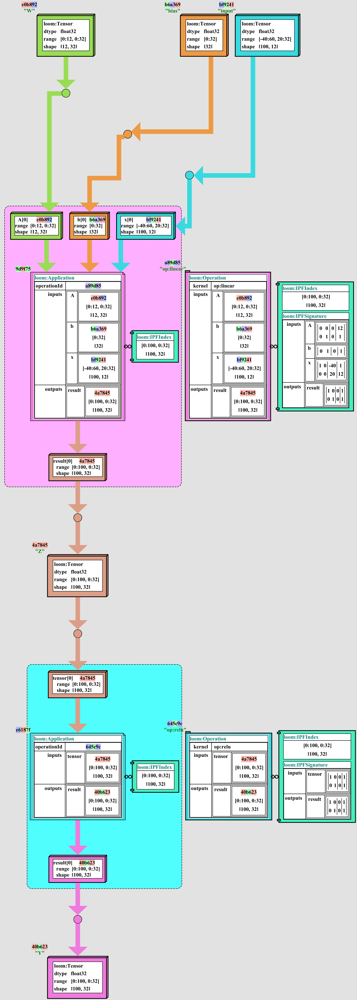
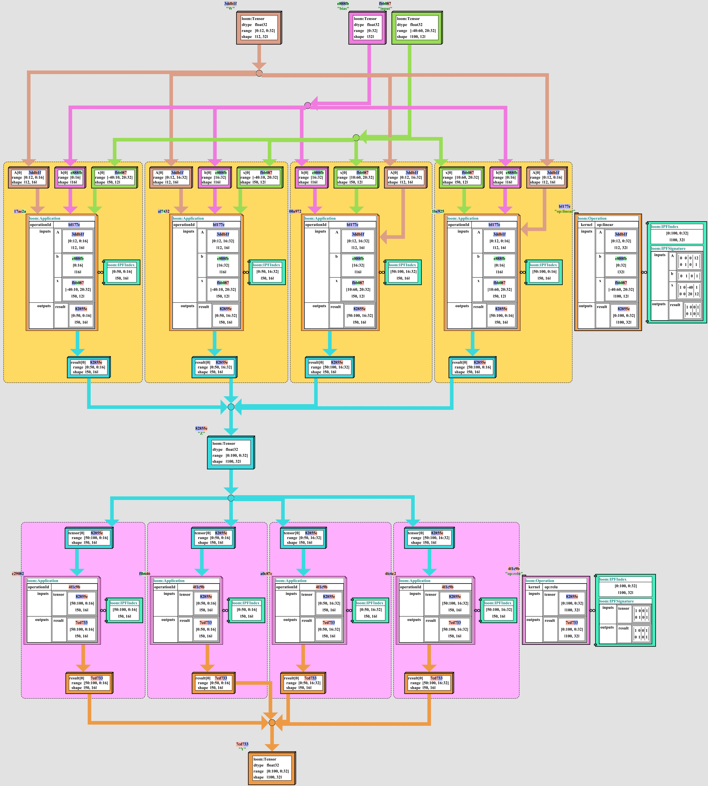

# Tapestry Project Overview

- [Tapestry Documentation](README.md)

### Contents

- [Abstract](#abstract)
- [Introduction](#introduction)
- [Motivation](#motivation)
- [Target Developer Experience](#target-developer-experience)
- [Target Compiler Researcher Experience](#target-compiler-researcher-experience)
- [Loom Modular IR](#loom-modular-ir)
  - [Loom Dialects](#Loom-dialects)
- [Validation Reporting Tooling](#validation-reporting-tooling)
- [Metakernels](#metakernels)
- [Graph Rewrite Rules](#graph-rewrite-rules)
- [Optimization](#optimization)
- [Target Environments](#target-environments)
- [Needs](#needs)

## Abstract

The goal of the **Tapestry Project** is to provide a complete and developer-friendly aggressive
toolchain for generating, visualizing, transforming, compiling, and optimizing AI and scientific
computing applications which are optimized for a variety of target architectures.

- [Motivation](#motivation)

The existing GPU-accelerated tensor environments (such as [PyTorch](https://pytorch.org/)) are
largely focused on providing a near drop-in equivalents for the [Numpy Api](https://numpy.org/), and
their focus on user-friendliness and compatibility with existing codebases has impeded R&D efforts
towards aggressive optimization of tensor applications.

Existing tensor applications often have run costs in the 10k GPU-year range; and even small
improvements in the efficiency of the above libraries translates into millions of dollars of savings
in power and compute resources.

A ground-up re-imagination of the development tensor algebra is possible on the back of the
polyhedral model, and this opens the possibility of a new generation of tensor algebra which is
optimized for aggressive re-write operations; replacing small efficiency gains with large
double-digit percentage gains.

- [Target Developer Experience](#target-developer-experience)

The target developer experience should resemble modern SQL or
[Apache Spark](https://spark.apache.com) / [Apache Beam](https://beam.apache.org/) development,
where expressions can be built up using symbolic operations, and passed to either compilers or
execution engines which can produce optimized code for a variety of target architectures.

- [Target Compiler Researcher Experience](#target-compiler-researcher-experience)

The target compiler researcher experience should permit developers and researches focused in tensor
algebras, polyhedral models, compiler optimizations, and system engineering pragmatics (such as RDMA
transfers, or GPU kernel programming) to work independently of each other, and to produce and share
their work in a way which is compatible with the work of others.

- [Loom Modular IR](#loom-modular-ir)

The **Tapestry Project** is built upon a modular and extensible IR (intermediate representation)
called **loom**, which permits strict targeted sub-dialects for each transform layer, with
appropriate graph semantics constraints, visualizers, and debuggers. This further contributes to
layer-isolation for development and research.

By developing and exploiting the layers, symbolic execution graphs can be transformed into concrete
polyhedral type operation graphs, and then sharded and optimized for different families of target
execution environments.

Directly competing with large existing compiler/language toolchains is an expensive task; and the
primary goal of **Tapestry** is to develop tools at each stage which reduce the future costs of R&D
on **Tapestry**, in support of being able to build the strongest possible optimizer for the
restricted _polyhedral type tensor block expression algebra_ which **Tapestry** represents.

- [Needs](#needs)

We are recruiting project development resources, research and implementation contributors, and grant
funding frameworks to further develop the project.

## Introduction

> The goal of the **Tapestry Project** is to develop a complete and developer-friendly toolchain for
> generating, visualizing, transforming, compiling, and optimizing polyhedral type tensor block
> algebra expressions into optimized code for a variety of target architectures.

That's a mouthful, so let's break it down.

A _tensor algebra expression_ is a mathematical expression that involves tensors, which are
multidimensional arrays of numbers. For example, a matrix is a 2-dimensional tensor, and a vector is
a 1-dimensional tensor. Tensor algebra is a generalization of matrix algebra, and is used in many
scientific and engineering applications, such as artificial intelligence, quantum mechanics, fluid
dynamics, and computer graphics.

An expression in a tensor algebra derives its value from a series of functional operations performed
on one or more tensors; and producing one or more tensors, for example, consider a basic matrix
multiplication:

```
A := <Tensor of size (m, n)>
B := <Tensor of size (n, p)>

C = MatMul(A, B)
# C := <Tensor of size (m, p)>
```

In compiler optimization, it is often useful to produce re-write rules, which state that one general
form of an expression can be transformed into another form that is at least equivalent, and
preferably more efficient to calculate. For example, the above expression can be re-written as a
composition of two operations (which in this case will probably not produce any benefit):

```
A := <Tensor of size (m, n)>
B := <Tensor of size (n, p)>

Z = Prod(A, B)
# Z := <Tensor of size (m, n, p)>

C = RowSum(Z, axis=1)
# C := <Tensor of size (m, p)>
```

Lacking further visibility into the internals of the operations, optimizers are limited to
re-writing expressions based on these re-write rules; and on altering where and when operations are
scheduled to run.

If we observe that many tensor operations are _block_ operations, in that they operate independently
on subsets of their inputs in such a way that it is possible to split them into smaller operations
and re-combine the results, we begin to see that there is a potential for optimization which looks
inside the operations in its restructuring.

The _polyhedral model_ or _[polytope model](https://en.wikipedia.org/wiki/Polytope_model)_ provides
a framework for describing _some_ block operations in a way which permits direct reasoning about
sub-sharding and recombination of the operations; without knowledge of the internals of the
operation itself.

The term _polyhedral type signature_ has come to be used to describe the spatial type of an
operation as it is described in the polyhedral model. This is a generalization of the term _block
operation_ to include the spatial type of the operation.

By extending a tensor block algebra with polyhedral type signatures, we can describe expressions of
block operations in a way that permits direct reasoning about sub-sharding and recombination of the
component operations, in addition to the above graph re-writing and scheduling.

```
A := <Tensor of size (m, n)>
B := <Tensor of size (n, p)>

C0 = MatMul(A, B[1:k])
# C0 := <Tensor of size (m, k)>

C1 = MatMul(A, B[k:])
# C1 := <Tensor of size (m, p - k)>

C = Concatenate([C0, C1], axis=1)
# C := <Tensor of size (m, p)>
```

This is discussed in much greater detail in the
[Polyhedral Types and Index Projection](PolyhedralTypesAndIndexProjection.md) document.

A _polyhedral type tensor block algebra_ optimizer toolchain is directly analogous to the SQL model;
where the SQL language permits the user to describe the _what_ of a query in terms of _relational
algebra_, and the SQL engine, by applying aggressive
[query optimization](https://en.wikipedia.org/wiki/Query_optimization) arrives at a
[query plan](https://en.wikipedia.org/wiki/Query_plan) which is equivalent to the original query,
but is more efficient to execute.

## Motivation

The space of GPU-accelerated tensor environments is already dominated by a few well-known
ecosystems; most notably [PyTorch](https://pytorch.org/), [TensorFlow](https://www.tensorflow.org/),
and [Jax](https://jax.readthedocs.io/).

These projects all started with an API surface they wished to replicate, namely the
[NumPy API](https://numpy.org/), which is a popular library for numerical computing in Python; and
is itself a partial clone of [R](https://www.r-project.org/), a popular language for statistical
computing. These statistical libraries have deep roots in the statistical and artificial
intelligence communities, and have been optimized for the ease of use of researchers, analysts, and
developers working in statistics, signal processing, and artificial intelligence.

As the primary goal of the extant GPU-accelerated tensor environments was to support acceleration of
research communities which were already working in numpy, R, and other similar languages, the
initial versions of these libraries focused heavily on providing a drop-in replacement for numpy,
and on providing a similar high-level API for the manipulation of tensors.

Optimization-friendly expression algebras (which support aggressive re-write operations) require a
significant amount of additional information about the operations being performed, and place strong
restrictions on the families of operations which are even permitted.

Worse, due to the restrictions, it is quite difficult to retrofit an existing tensor algebra with
the necessary information to support aggressive re-write operations; as it is quite likely than many
existing operations in the algebra to be retrofitted will not be compatible with the necessary
restrictions.

**NumPy** wasn't written to be optimized in this way. A large portion of the api surface is
compatible with the necessary restrictions, but a significant portion is not. The same is true of
the libraries which were written as developer api replacements for numpy.

At the same time, the total investment being spent on power and compute resources for large tensor
operations is growing rapidly; even small improvements in the efficiency of the above libraries
translates into millions of dollars of savings in power and compute resources.

Their development budgets are driven by small scale gains with massive compounding effects; and as a
result the teams are largely precluded from exploring ground-up re-writes of their tensor algebras
to support aggressive re-write operations.

### Target Developer Experience

The goal of the **Tapestry** project is to provide a complete and developer-friendly toolchain for
generating, visualizing, transforming, compiling, and optimizing polyhedral type tensor block
algebra expressions into optimized code for a variety of target architectures.

The developer experience should resemble modern SQL development; or symbolic execution data flow
languages such as [Apache Beam](https://beam.apache.org/) or
[Apache Spark](https://spark.apache.org/).

Expressions can be built up using symbolic operations (which produce a description of the work,
rather than immediately doing the work), and passed to either compilers or execution engines which
can produce optimized code for a variety of target architectures.

For example, the following symbolic expression:

```
Tensor input = ...;
// dtype: float32
// range:
//   start: [-40, 20]
//   end: [60, 32]
//   shape: (100, 12)

Tensor weights = ...;
// dtype: float32
// range:
//   start: [0, 0]
//   end: [12, 32]
//   shape: [12, 32]

Tensor bias = ...;
// dtype: float32
// range:
//   start: [0]
//   end: [32]
//   shape: [32]

Tnesor z = Linear(input, weights, bias);

Tensor y = Relu(z);

Tapestry.run(y);
```

Could be expanded and manipulated in various stages of transformation to expand and optimize the
code in a variety of ways, and then passed to a compiler or execution engine to produce optimized
code for a variety of target architectures:

<table style="border: 0">
  <tr>
    <td>
      <div style="width: 100%; margin: auto">
        
      </div>
    </td>
    <td>
      <div style="width: 100%; margin: auto">
        
      </div>
    </td>
  </tr>
</table>

Additionally, the toolchain should provide a rich set of debugging and visualization tools for
exploring the intermediate representations of the expressions, and for exploring the optimizations
applied to the expressions.

## Target Compiler Researcher Experience

- Good R&D Tools => Cheap R&D Cycles
- Cheap R&D Cycles => More R&D Cycles
- More R&D Cycles => Greater Velocity
- Therefore,
  - **Good R&D Tools => Greater Velocity**

A critical goal of the **Tapestry** project is to provide as much support to internal development
and research teams as possible, to reduce the future costs of R&D on **Tapestry**.

The development cost of new graph re-write rules, new metakernels, and new target environments and
cost models should be easy to write, easy to visualize, easy to validate, and easy to debug.

To this extent, the validation reporting tooling, constraint validation system, and associated
tooling for mechanically constructing and reporting complex errors, reporting them in structured
data, and visualizing those errors in common formats, such as rendered as text for exception
handlers, is a major part of the **Tapestry** project.

## Loom Modular IR

> **IR is Destiny.**

A compiler's internal representation (commonly called the
[intermediate representation](https://en.wikipedia.org/wiki/Intermediate_representation), as it
exists between the source code which was parsed and the target code to be generated) determines most
things about the complexity and capabilities of the compiler.

Information which can be retrieved or verified easily in an **IR** can be used for analysis and
manipulation with a little code; information which is fragile or difficult to retrieve or verify
requires a lot of code to work with. And code which is difficult to work with is code which is
difficult to maintain, and difficult to extend.

In targeting a toolchain which spans from abstract tensor algebra expressions to optimized code for
a variety of target architectures, the **IR** is the most important part of the toolchain; and the
ability to extend and constrain the **IR** for different layers of that toolchain, and for different
primitives appropriate to different target architectures, is the most important part of the **IR**.

Tapestry is designed with a modular **IR** which permits the easy addition of new node types, node
tags, and graph constraints. By selectively including a set of types and constraints, strictly
defined sub-dialects can be created which are appropriate for different layers of the toolchain, and
for different primitives appropriate to different target architectures.

In this way, toolchain operations which transform from one layer to another can be written in a
type-safe way which transform from one dialect to another; and targeted query, debugging, and
visualization tools can be written which are appropriate for the layer of the toolchain being
targeted.

As the core representation, serialization, and scanning code are shared by all dialects, much of the
verification and manipulation code can be shared as well; and the code which is not shared is
written in a type-safe way which is appropriate for the layer of the toolchain being targeted.

The **Tapestry** **IR** is called **loom**.

A **LoomGraph** is a collection of nodes, paired with a **LoomEnvironment** defining constraints on
what constitutes legal values and relationships for those nodes.

A raw **LoomGraph** is a JSON document collection of nodes:

```json
{
  "id": "<UUID>",
  "nodes": [
    {
      "id": "<UUID>",
      "label": "<Label>",
      "type": "<Type>",
      "body": <JSON>,
      "tags": {
        "<Type>": <JSON>
      }
    },
    ...
  ]
}
```

Each **LoomNode** has:

- `id` - a unique UUID identifier
- `label` - an optional, non-unique string label
- `type` - a string type identifier
- `body` - a `type`-dependent JSON structure
- `tags` - a tag type keyed map of `{<type>: <JSON>}` of tag type dependent node extensions

Each **node type** and **tag type** is expected to have a corresponding schema, defined and enforced
by the **LoomEnvironment**; and is expected to be parsable by type-dependent node wrappers, which
understand the data and can provide a type-safe api for manipulating the data.

By defining additional types and constraints, we can compositionally construct language dialects
with strict semantics, reusing types and constraints across several dialects.

#### Example

Assuming two very simple types, a tensor and a simple operation with no sharding information, we
could define types and graphs such that a desaturation operation is performed on a tensor of images:

```json
{
  "id": "d290f1ee-6c54-4b01-90e6-d701748f0851",
  "nodes": [
    {
      "id": "8e3f8f1e-6c54-4b01-90e6-0ae1a048f0851",
      "type": "https://<schema-url>#/types/Tensor",
      "label": "Images",
      "body": {
        "dtype": "uint8",
        "shape": [100, 256, 256, 3]
      }
    },
    {
      "id": "8e3f8f1e-6c54-4b01-90e6-0ae1a048f9000",
      "type": "https://<schema-url>#/types/Tensor",
      "label": "Monochrome",
      "body": {
        "dtype": "uint8",
        "shape": [100, 256, 256]
      }
    },
    {
      "id": "8e3f8f1e-6c54-4b01-90e6-0ae1a048faaaa",
      "type": "https://<schema-url>#/types/Operation",
      "body": {
        "kernel": "desaturate",
        "inputs": ["8e3f8f1e-6c54-4b01-90e6-0ae1a048f0851"],
        "outputs": ["8e3f8f1e-6c54-4b01-90e6-0ae1a048f9000"]
      }
    }
  ]
}
```

> **NOTE**: The modern XML standards family provides a very strong environment for defining and
> validating complex data structures. The XML family is also very well-supported in many languages
> and platforms.
>
> However, the standards which provide the fully fleshed out versions of schemas and query language,
> the 2.0/3.0 family of XSD, XPath, XQuery, and XSLT, have only one conformant implementation
> family, which charges very high per-seat licensing fees for the use of the software.
>
> As such, it is not a viable target for an open-source project.

### Loom Dialects

The goal of loom dialects are to define strictly limited expression IRs for a targeted layers of the
toolchain.

In doing so, we can define:

- An **Abstract Expression Dialect** for describing applications of tensor algebra expressions,
  abstracted from the intermediate result shapes.
- An **Operation Expression Dialect** for describing concrete polyhedral type tensor algebra block
  expressions, decorated with polyhedral signatures and intermediate result shapes.
- An **Application Expression Dialect** for describing concrete block sharding of sub-operation
  applications, and their index locations in the polyhedral index space of their parent operation.
- Families of **Target Environment Dialects**, expanding the **Application Expression Dialect** with
  additional primitives and constraints to represent execution and memory placement and scheduling
  information for a variety of target environments.

## Validation Reporting Tooling

As the a high level goal is to drive the cost of R&D on **Tapestry** down, a core part of the
**Loom** environment is the constraint validation system, and the associated tooling for
mechanically constructing and reporting complex errors, reporting them in structured data, and
visualizing those errors in common formats, such as rendered as text for exception handlers.

Consider the following constraint error, detecting reference cycles in a graph:

<details>
<summary>Click for Validation Builder</summary>

```java
@Override
public void validateConstraint(
        @Nonnull @SuppressWarnings("unused") LoomEnvironment env,
        @Nonnull LoomGraph graph,
        @Nonnull ValidationIssueCollector issueCollector
) {
  for (var cycle : TraversalUtils.findOperationSimpleCycles(graph)) {
    var cycleDesc = cycle
          .stream()
          .map(item -> {
            var desc = new HashMap<>();
            desc.put("id", item.getId());
            desc.put("type", item.getType());
            if (item.getLabel() != null) {
              desc.put("label", item.getLabel());
            }
            return desc;
          })
          .toList();

    issueCollector.addIssue(
          ValidationIssue
                  .builder()
                  .type(LoomConstants.Errors.REFERENCE_CYCLE_ERROR)
                  .summary("Reference Cycle detected")
                  .context(b -> b.name("Cycle").data(cycleDesc))
    );
  }
}
```

</details>

<details>
<summary>Click for JSON Error</summary>

```json
[
  {
    "type": "ReferenceCycle",
    "summary": "Reference Cycle detected",
    "contexts": [
      {
        "name": "Cycle",
        "data": [
          {
            "id": "3eaa349d-818d-4084-8f71-aaecb2a674cb",
            "label": "Add",
            "type": "http://tensortapestry.org/schemas/loom/2024-01/node_types.jsd#/nodes/Operation"
          },
          {
            "id": "58236994-20f1-4932-add5-3721f609c0aa",
            "label": "A",
            "type": "http://tensortapestry.org/schemas/loom/2024-01/node_types.jsd#/nodes/Tensor"
          }
        ]
      }
    ]
  }
]
```

</details>

```
org.tensortapestry.common.validation.LoomValidationError: Validation failed with 1 issues:

* Error [ReferenceCycle]: Reference Cycle detected

  - Cycle::

    |> [ {
    |>   "id" : "d0e577e8-4e3b-450e-a89d-be06db502db6",
    |>   "label" : "Add",
    |>   "type" : "http://tensortapestry.org/schemas/loom/2024-01/node_types.jsd#/nodes/Operation"
    |> }, {
    |>   "id" : "14c9064e-b30a-4d09-84c6-e61d05ba107c",
    |>   "label" : "A",
    |>   "type" : "http://tensortapestry.org/schemas/loom/2024-01/node_types.jsd#/nodes/Tensor"
    |> } ]


	at org.tensortapestry.common.validation.ListValidationIssueCollector.check(ListValidationIssueCollector.java:47)
	at org.tensortapestry.loom.graph.LoomEnvironment.validateGraph(LoomEnvironment.java:175)
	at org.tensortapestry.loom.graph.LoomGraph.validate(LoomGraph.java:164)

```

## Metakernels

The code implementing an operation is generally referred to as the **kernel** for that operation.
Given actual data for an operation, calling the **kernel** in an appropriate environment will
validate the structure of that data (correct parameters and inputs passed, etc), and produce a
result.

To describe the behavior of a kernel we do not wish to execute, but to **symbolically execute**,
processing not data, but symbolic descriptions of data, we need a program which will consume the
symbolic representation of the inputs and parameters, validate that they are well formed versus the
**kernel**'s expectations, and produce a symbolic representation of the expected outputs of the
**kernel**.

In **Tapestry** we call this program a **metakernel**, at it is executed on the symbolic level,
rather than the data level.

**Tapestry** requires that for each kernel we wish to represent in a symbolic execution graph, we
have a corresponding **metakernel** which can be applied to symbolic representations of inputs to
describe the kernel's behavior. Additionally, this **metakernel** must attach a **polyhedral type
signature** to the symbolic representation of the output, which describes the spatial type of the
output in terms of the polyhedral model, to enable re-write and re-sharding operations.

As we need a **metakernel** for each external **kernel** in a target execution environment, and as
we expect third party libraries and developer applications to frequently provide their own
**kernels**, we need a way to describe **metakernels** in a way which is easy to write, easy to
validate, and easy to share.

Were we required to write a compliant **metakernel** for each target **kernel** _for each
**Tapestry** compiler environment_, the cost of R&D on **Tapestry** would be very high, and the cost
of R&D on **Tapestry** for third party developers would be even higher.

A major goal of **Tapestry** is to reduce this cost by developing a portable template environment in
which portable **template metakernels** can be written, validated, and shared.

Consider the following draft-proposal for a **template metakernel** for a matrix multiplication,
which is a common operation in tensor algebra.

In this proposal, we match a shape expression language on the inputs (`X` and `W`), such that we
extract batch dimensions from the input (`X`), and constrain `$b` to match between the `X` and `W`
inputs. Then polyhedral type signatures are attached to the inputs and outputs in terms of their
matched shapes; and a common polyhedral index is used to describe the spatial extent of the
operation, and the mapping to the output.

```yaml
matmul:
  index: "[$shape..., $a, $c]"

  constraints:
    dtype:
      enum:
        - int32
        - int64
        - float32
        - float64
        - complex64
        - complex128

  inputs:
    X:
      shape: "[$shape..., $a, $b]"
      dtype: "$dtype"

      # this is shorthand for:
      # ipf:
      #   map: "[..., 1, 0]"
      #   shape: "[..., 1, $b]"
      #
      # which is shorthand for:
      # ipf:
      #   map: "[ones($index.size - 2)..., 1, 0]"
      #   shape: "[ones($index.size - 2)..., 1, $b]"
      #
      # Where the map unpacks to a diagonal matrix
      # with 1s on the prefix dimensions.
      ipf: "[..., 1, 0] :> [..., 1, $b]"

    W:
      shape: "[$b, $c]"
      dtype: "$dtype"
      ipf: "[..., 0, 1] :> [..., $b, 1]"

  outputs:
    result:
      # shape defaults to: "[$.index...]"
      # ipf defaults to: "[...] >: [...]"
      dtype: "$dtype"
```

The work on **template metakernels** is ongoing, and is expected to be a major part of the
**Tapestry** project.

## Graph Rewrite Rules

Graph re-write rules are a common tool in compiler optimization, and are used to describe how one
general form of an expression can be transformed into another form that is at least equivalent, and
preferably more efficient to calculate. In **Tapestry**, graph re-write rules are used to describe
how one sub-graph expression can be transformed into another equivalent form.

The intention is to heavily leverage the [Metakernels](#metakernels) template language to describe
the behavior of the re-write rules, and to use the same language to describe the behavior of the
**metakernels** which are being re-written.

This work is ongoing, and is expected to be a major part of the **Tapestry** project.

## Optimization

Given a family of semantics preserving re-write and sharding rules, all that is needed in order to
produce an initial optimizer is a way to assign value to variations in the graph.

For each given [Target Environment](#target-environments), we can develop a target cost model which
assigns a vector of labeled costs (wall-clock time, machine count, memory usage, idle resource
count) to a graph expression instances.

Plural cost models are perfect fits for Pareto optimization environments; and Pareto optimization
environments are [embarrassingly parallel](https://en.wikipedia.org/wiki/Embarrassingly_parallel),
in that we can horizontally add as many additional worker threads or machines as we like, for linear
speedups in the optimization search process.

As it is common to encounter AI models which see 10k GPU-year run costs, and as it is common to
encounter AI models which are run in production environments with 1000s of machines, the potential
impact of even small improvements in the efficiency of the optimizer is quite large.

As the optimizer can be run in parallel, large optimization search spaces can be examined by tasking
many search machines, proportional to the expected value of improvements for the given target
application.

Over time, research can improve the efficiency of the optimizer, and the quality of the cost models,
and the quality of the re-write and sharding rules, and the quality of the metakernels,

But even initial versions of the optimizer can be expected to produce significant improvements in
the efficiency of the target applications; if sufficient resources are allocated to the optimizer
search process.

## Target Environments

Each new target environment will likely a new **loom** dialect, adding primitives and constraints
describing placement and scheduling of operations in the target environment.

Each new target environment will likely also require a new symbolic cost model, which assigns a
vector of labeled costs (wall-clock time, machine count, memory usage, idle resource count) to a
graph expression instance in the target environment's loom dialect.

There is a possibility of sharing many common **kernel** (and their associated **metakernels**)
across target environments, and the **Tapestry** project is expected to develop tooling to support
this.

## Needs

**Tapestry** is at a recruiting / growth stage in the project, and we are looking for the following
types of support:

### R&D Support

We need additional technical and research contributors to help develop the project from initial
research stage to a fully functional optimizer targeting PyTorch and Jax backends.

### Project Support

We need project management and development resources to help organize the project and recruit
additional contributors.

### Funding

We need grant funding frameworks to further develop the project.

Historically, languages and compilers have not been successful outside of open source / free
software models. **Subscription** compilers do exist, but as performance options when open reference
compilers also exist for an environment. Developers have been historically unwilling to tie their
work to a proprietary language or compiler.

Finding a funding model which is compatible with the open source / free software model for the base
environment is a major goal of the project.

There are development models where the base environment is open source / free software, and support
services are offered to companies which wish to prioritize their extension and development needs for
the environment.

There are also models where the base environment is open source / free software, and products are
developed which commercially exploit the environment under the same funding structure.
