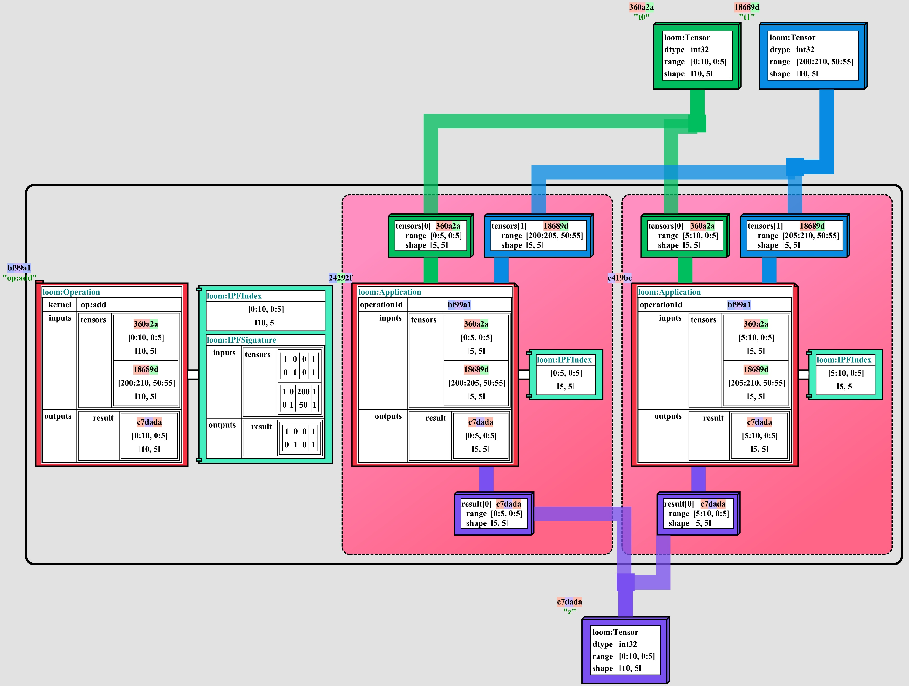

# Application Expression Dialect

[Tapestry Documentation](../README.md)

### Contents

- [Overview](#Overview)
- [Types](#Types)
- [Examples](#Examples)
- [Constraints](#Constraints)

## Overview

The Application Expression Dialect is a dialect for representing application sharded operations and
tensors in a graph.

It extends the [Operation Expression Dialect](OperationExpressionDialect.md) to include Application
shards, and constraints for application sharded operations.

See:
[ApplicationExpressionDialect.java](../../tensortapestry-loom/src/main/java/org/tensortapestry/loom/graph/dialects/tensorops/ApplicationExpressionDialect.java)

## Types

Supported Node Types:

- `Tensor` - represents a logical tensor
  - `dtype` - the data type of the tensor
  - `range` - the spatial range of the tensor
    - `start` - the start of the range
    - `end` - the end of the range
    - _derived_
      - `shape` - the shape of the range
      - `size` - the size of the range
- `Operation` - represents a logical operation
  - `kernel` - the id of the operation kernel
  - `params` - a map of json parameters to the kernel
  - `inputs` - a tensor selection map of input tensors
    - `{<name>: [{"tensorId": <id>, "range": <range>}, ...]}`
  - `outputs` - a tensor selection map of output tensors
    - `{<name>: [{"tensorId": <id>, "range": <range>}, ...]}`
  * _Tags_
    - `IPFSignature` - operation polyhedral projection signature.
    - `IPFIndex` - operation polyhedral projection index.
- `Application` - represents a shard of an `Operation`
  - `operationId` - the id of the operation kernel
  - `inputs` - a tensor selection map of input tensor shards
    - `{<name>: [{"tensorId": <id>, "range": <range>}, ...]}`
  - `outputs` - a tensor selection map of output tensor shards
    - `{<name>: [{"tensorId": <id>, "range": <range>}, ...]}`
  * _Tags_
    - `IPFIndex` - operation polyhedral projection index.

## Examples

Consider a small operation example, roughly equivalent to the pseudocode:

```python
t0 = Tensor("int32", shape=(10, 5))
t1 = Tensor("int32", start=(200, 50), shape=(10, 5))

op = add(tensors=(t0, t1))

z = op.result()
# or `z = op.outputs['result'][0]`

op.shard({ "start": [0, 0], "end": [5, 5]}, { "start": [5, 0], "end": [10, 5]})
```

The input tensor selections can select any sub-range of the input tensor, and the output tensor
selections must be total over the output tensor range.

<details>
<summary>LoomGraph JSON</summary>

```json
{
  "id": "bdc87aaf-3716-419d-abfb-fe6e21bd6892",
  "nodes": [
    {
      "id": "0308d788-0064-4494-9c18-6e4c3d078b13",
      "type": "http://tensortapestry.org/schemas/loom/2024-01/node_types.jsd#/nodes/Tensor",
      "label": "t1",
      "body": {
        "dtype": "int32",
        "range": {
          "start": [200, 50],
          "end": [210, 55]
        }
      }
    },
    {
      "id": "2524fb44-d169-4afd-90fa-09711462e4b3",
      "type": "http://tensortapestry.org/schemas/loom/2024-01/node_types.jsd#/nodes/Application",
      "body": {
        "operationId": "26434d32-ccbc-442f-9d78-8bf158b00c6b",
        "inputs": {
          "tensors": [
            {
              "tensorId": "2fa3fe28-2d47-47b6-8767-27c7dadbb18c",
              "range": {
                "start": [5, 0],
                "end": [10, 5]
              }
            },
            {
              "tensorId": "0308d788-0064-4494-9c18-6e4c3d078b13",
              "range": {
                "start": [205, 50],
                "end": [210, 55]
              }
            }
          ]
        },
        "outputs": {
          "result": [
            {
              "tensorId": "781dd44d-cf72-4533-a495-6ff66ba1689a",
              "range": {
                "start": [5, 0],
                "end": [10, 5]
              }
            }
          ]
        }
      },
      "tags": {
        "http://tensortapestry.org/schemas/loom/2024-01/tag_types.jsd#/tags/IPFIndex": {
          "start": [5, 0],
          "end": [10, 5]
        }
      }
    },
    {
      "id": "26434d32-ccbc-442f-9d78-8bf158b00c6b",
      "type": "http://tensortapestry.org/schemas/loom/2024-01/node_types.jsd#/nodes/Operation",
      "label": "op:add",
      "body": {
        "kernel": "op:add",
        "inputs": {
          "tensors": [
            {
              "tensorId": "2fa3fe28-2d47-47b6-8767-27c7dadbb18c",
              "range": {
                "start": [0, 0],
                "end": [10, 5]
              }
            },
            {
              "tensorId": "0308d788-0064-4494-9c18-6e4c3d078b13",
              "range": {
                "start": [200, 50],
                "end": [210, 55]
              }
            }
          ]
        },
        "outputs": {
          "result": [
            {
              "tensorId": "781dd44d-cf72-4533-a495-6ff66ba1689a",
              "range": {
                "start": [0, 0],
                "end": [10, 5]
              }
            }
          ]
        }
      },
      "tags": {
        "http://tensortapestry.org/schemas/loom/2024-01/tag_types.jsd#/tags/IPFIndex": {
          "start": [0, 0],
          "end": [10, 5]
        },
        "http://tensortapestry.org/schemas/loom/2024-01/tag_types.jsd#/tags/IPFSignature": {
          "inputs": {
            "tensors": [
              {
                "affineMap": {
                  "projection": [
                    [1, 0],
                    [0, 1]
                  ],
                  "offset": [0, 0]
                },
                "shape": [1, 1]
              },
              {
                "affineMap": {
                  "projection": [
                    [1, 0],
                    [0, 1]
                  ],
                  "offset": [200, 50]
                },
                "shape": [1, 1]
              }
            ]
          },
          "outputs": {
            "result": [
              {
                "affineMap": {
                  "projection": [
                    [1, 0],
                    [0, 1]
                  ],
                  "offset": [0, 0]
                },
                "shape": [1, 1]
              }
            ]
          }
        }
      }
    },
    {
      "id": "2af709e2-c792-4712-80cc-0624ee767115",
      "type": "http://tensortapestry.org/schemas/loom/2024-01/node_types.jsd#/nodes/Application",
      "body": {
        "operationId": "26434d32-ccbc-442f-9d78-8bf158b00c6b",
        "inputs": {
          "tensors": [
            {
              "tensorId": "2fa3fe28-2d47-47b6-8767-27c7dadbb18c",
              "range": {
                "start": [0, 0],
                "end": [5, 5]
              }
            },
            {
              "tensorId": "0308d788-0064-4494-9c18-6e4c3d078b13",
              "range": {
                "start": [200, 50],
                "end": [205, 55]
              }
            }
          ]
        },
        "outputs": {
          "result": [
            {
              "tensorId": "781dd44d-cf72-4533-a495-6ff66ba1689a",
              "range": {
                "start": [0, 0],
                "end": [5, 5]
              }
            }
          ]
        }
      },
      "tags": {
        "http://tensortapestry.org/schemas/loom/2024-01/tag_types.jsd#/tags/IPFIndex": {
          "start": [0, 0],
          "end": [5, 5]
        }
      }
    },
    {
      "id": "2fa3fe28-2d47-47b6-8767-27c7dadbb18c",
      "type": "http://tensortapestry.org/schemas/loom/2024-01/node_types.jsd#/nodes/Tensor",
      "label": "t0",
      "body": {
        "dtype": "int32",
        "range": {
          "start": [0, 0],
          "end": [10, 5]
        }
      }
    },
    {
      "id": "781dd44d-cf72-4533-a495-6ff66ba1689a",
      "type": "http://tensortapestry.org/schemas/loom/2024-01/node_types.jsd#/nodes/Tensor",
      "label": "z",
      "body": {
        "dtype": "int32",
        "range": {
          "start": [0, 0],
          "end": [10, 5]
        }
      }
    }
  ]
}
```

</details>



## Constraints

Imports all: [OperationExpressionDialect > Constraints](OperationExpressionDialect.md#constraints)

### TensorDTypesAreValidConstraint

See:
[TensorDTypesAreValidConstraint.java](../../tensortapestry-loom/src/main/java/org/tensortapestry/loom/graph/dialects/tensorops/constraints/TensorDTypesAreValidConstraint.java)

This constraint ensures that all tensors in the graph have a data type that is one of a predefined
set.

> _NOTE_: There are open questions as to if this constraint is appropriate. On the one hand, it sets
> hard limits on tensor types for a graph; and an environment may wish to enforce what data types
> are representable. On the other hand, it is implicit in the family of kernels permitted in the
> graph, and may be redundant.
>
> It also complicates environment management; as the set of legal data types can legitimately vary
> for different graphs which are otherwise sharing the same environment.

### TensorOperationAgreementConstraint

See:
[TensorOperationAgreementConstraint.java](../../tensortapestry-loom/src/main/java/org/tensortapestry/loom/graph/dialects/tensorops/constraints/TensorOperationAgreementConstraint.java)

This constraint ensures that the tensors referenced by an operation exist, and that tensor
selections used by the operation are within the range provided by each operation.

### NoTensorOperationCyclesConstraint

See:
[NoTensorOperationCyclesConstraint.java](../../tensortapestry-loom/src/main/java/org/tensortapestry/loom/graph/dialects/tensorops/constraints/NoTensorOperationCyclesConstraint.java)

This constraint ensures that the tensor/operation graph is a directed acyclic graph (DAG) with
respect to tensor/operation edges, with no cycles.

### OperationIPFSignatureAgreementConstraint

See:
[OperationIPFSignatureAgreementConstraint.java](../../tensortapestry-loom/src/main/java/org/tensortapestry/loom/graph/dialects/tensorops/constraints/OperationIPFSignatureAgreementConstraint.java)

This constraint ensures that every operation with a `IPFSignature` tag has an `IPFIndex` tag as
well, and that the tensor selection maps of the operation are projections of the index through the
signature.

### OperationApplicationAgreementConstraint

See:
[OperationApplicationAgreementConstraint.java](../../tensortapestry-loom/src/main/java/org/tensortapestry/loom/graph/dialects/tensorops/constraints/OperationApplicationAgreementConstraint.java)

This constraint ensures that the inputs and outputs of an `Application` node are consistent and
within the ranges of the associated `Operation` node.

It also ensures that no `Application` node is an orphan.

### ApplicationIPFSignatureAgreementConstraint

See:
[ApplicationIPFSignatureAgreementConstraint.java](../../tensortapestry-loom/src/main/java/org/tensortapestry/loom/graph/dialects/tensorops/constraints/ApplicationIPFSignatureAgreementConstraint.java)

This constraint ensures that all `Application` nodes with an `IPFIndex` tags have `inputs` and
`outputs` matching the projection of the index through their associated `Operation` node's
`IPFSignature` tag.

### ApplicationOutputRangeCoverageIsExactConstraint

See:
[ApplicationOutputRangeCoverageIsExactConstraint.java](../../tensortapestry-loom/src/main/java/org/tensortapestry/loom/graph/dialects/tensorops/constraints/ApplicationOutputRangeCoverageIsExactConstraint.java)

This constraint ensures that the output ranges of all `Application` node shards of an `Operation`
node exactly combine to cover the output ranges of the `Operation` node, without overlaps or gaps.
