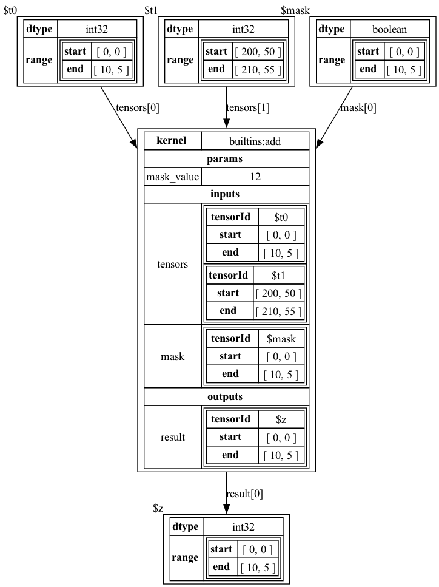

# Operation Expression Dialect

[Tapestry Documentation](../README.md)

### Contents

* [Overview](#Overview)
* [Types](#Types)
* [Examples](#Examples)
* [Constraints](#Constraints)

## Overview

The Operation Expression Dialect is a dialect for representing un-sharded operations and tensors in a graph.

See: [OperationExpressionDialect.java](../../tensortapestry-loom/src/main/java/org/tensortapestry/loom/graph/dialects/tensorops/OperationExpressionDialect.java)

## Types

Supported Node Types:
 * `Tensor` - represents a logical tensor
   - `dtype` - the data type of the tensor
   - `range` - the spatial range of the tensor
     - `start` - the start of the range
     - `end` - the end of the range
     - *derived*
       - `shape` - the shape of the range
       - `size` - the size of the range
 * `Operation` - represents a logical operation
   - `kernel` - the id of the operation kernel 
   - `params` - a map of json parameters to the kernel
   - `inputs` - a tensor selection map of input tensors
       - `{<name>: [{"tensorId": <id>, "range": <range>}, ...]}`
   - `outputs` - a tensor selection map of output tensors
       - `{<name>: [{"tensorId": <id>, "range": <range>}, ...]}`
       * *Tags*
           - `IPFSignature` - operation polyhedral projection signature.
           - `IPFIndex` - operation polyhedral projection index.

The `IPFSignature` is a [Polyhedral Projection Signature](../PolyhedralTypesAndIndexProjection.md)
map that describes the projection of the operation's input tensors to the operation's output tensors.
  - `inputs` : `{<name>: [<index projection function>, ...]}`
  - `outputs` : `{<name>: [<index projection function>, ...]}`

Where an `IPF` or *index projection function* is an affine map from points in
the index coordinate space to ranges in the tensor coordinate space.
  - `projection` - an affine projection from a point in the index space to a point in the tensor space.
    - `affineMap` : a matrix from the index space to the tensor space.
    - `offset` : a vector offset in the tensor space.
  - `shape`: the shape of the projected range in tensor space, as an offset from the projection point.


## Examples

Consider a small operation example, roughly equivalent to the pseudocode:

```python
t0 = Tensor("int32", shape=(10, 5))
t1 = Tensor("int32", start=(200, 50), shape=(10, 5))
mask = Tensor("boolean", shape=(10, 5))
op = add(tensors=(t0, t1), mask=mask, mask_value=12)

z = op.result()
# or `z = op.outputs['result'][0]`
```

The input tensor selections can select any sub-range of the input tensor, and the output tensor selections
must be total over the output tensor range.

<details>
<summary>LoomGraph JSON</summary>

```json
{
  "id" : "d3f46c69-6f2f-4dce-adf0-6f6fec9a34b8",
  "nodes" : [ {
    "id" : "16d1e319-f00b-4059-902f-f6fbb9112e5f",
    "type" : "http://tensortapestry.org/schemas/loom/2024-01/node_types.jsd#/nodes/Tensor",
    "label" : "mask",
    "body" : {
      "dtype" : "boolean",
      "range" : {
        "start" : [ 0, 0 ],
        "end" : [ 10, 5 ]
      }
    }
  }, {
    "id" : "21a4f7f7-15f4-427b-8616-057ff251bf64",
    "type" : "http://tensortapestry.org/schemas/loom/2024-01/node_types.jsd#/nodes/Tensor",
    "label" : "t1",
    "body" : {
      "dtype" : "int32",
      "range" : {
        "start" : [ 200, 50 ],
        "end" : [ 210, 55 ]
      }
    }
  }, {
    "id" : "4ace7920-10c2-4a66-9ac2-90ca0b3d0a40",
    "type" : "http://tensortapestry.org/schemas/loom/2024-01/node_types.jsd#/nodes/Tensor",
    "label" : "t0",
    "body" : {
      "dtype" : "int32",
      "range" : {
        "start" : [ 0, 0 ],
        "end" : [ 10, 5 ]
      }
    }
  }, {
    "id" : "4c7342c9-b9a3-4b59-8d59-b7c579076863",
    "type" : "http://tensortapestry.org/schemas/loom/2024-01/node_types.jsd#/nodes/Operation",
    "label" : "op0",
    "body" : {
      "kernel" : "builtins:add",
      "params" : {
        "mask_value" : 12
      },
      "inputs" : {
        "mask" : [ {
          "tensorId" : "16d1e319-f00b-4059-902f-f6fbb9112e5f",
          "range" : {
            "start" : [ 0, 0 ],
            "end" : [ 10, 5 ]
          }
        } ],
        "tensors" : [ {
          "tensorId" : "4ace7920-10c2-4a66-9ac2-90ca0b3d0a40",
          "range" : {
            "start" : [ 0, 0 ],
            "end" : [ 10, 5 ]
          }
        }, {
          "tensorId" : "21a4f7f7-15f4-427b-8616-057ff251bf64",
          "range" : {
            "start" : [ 200, 50 ],
            "end" : [ 210, 55 ]
          }
        } ]
      },
      "outputs" : {
        "result" : [ {
          "tensorId" : "5816b59d-b5a5-47ca-8916-8e26e0f119c4",
          "range" : {
            "start" : [ 0, 0 ],
            "end" : [ 10, 5 ]
          }
        } ]
      }
    }
  }, {
    "id" : "5816b59d-b5a5-47ca-8916-8e26e0f119c4",
    "type" : "http://tensortapestry.org/schemas/loom/2024-01/node_types.jsd#/nodes/Tensor",
    "label" : "z0",
    "body" : {
      "dtype" : "int32",
      "range" : {
        "start" : [ 0, 0 ],
        "end" : [ 10, 5 ]
      }
    }
  } ]
}
```

</details>



## Constraints

### TensorDTypesAreValidConstraint

See: [TensorDTypesAreValidConstraint.java](../../tensortapestry-loom/src/main/java/org/tensortapestry/loom/graph/dialects/tensorops/constraints/TensorDTypesAreValidConstraint.java)

This constraint ensures that all tensors in the graph have a data type that is 
one of a predefined set.

> *NOTE*: There are open questions as to if this constraint is appropriate.
> On the one hand, it sets hard limits on tensor types for a graph;
> and an environment may wish to enforce what data types are representable.
> On the other hand, it is implicit in the family of kernels permitted
> in the graph, and may be redundant.
> 
> It also complicates environment management; as the set of legal data types
> can legitimately vary for different graphs which are otherwise sharing
> the same environment.

### TensorOperationAgreementConstraint

See: [TensorOperationAgreementConstraint.java](../../tensortapestry-loom/src/main/java/org/tensortapestry/loom/graph/dialects/tensorops/constraints/TensorOperationAgreementConstraint.java)

This constraint ensures that the tensors referenced by an operation exist, and that tensor selections
used by the operation are within the range provided by each operation.

### NoTensorOperationCyclesConstraint

See: [NoTensorOperationCyclesConstraint.java](../../tensortapestry-loom/src/main/java/org/tensortapestry/loom/graph/dialects/tensorops/constraints/NoTensorOperationCyclesConstraint.java)

This constraint ensures that the tensor/operation graph is a directed acyclic graph (DAG)
with respect to tensor/operation edges, with no cycles.

### OperationIPFSignatureAgreementConstraint

See: [OperationIPFSignatureAgreementConstraint.java](../../tensortapestry-loom/src/main/java/org/tensortapestry/loom/graph/dialects/tensorops/constraints/OperationIPFSignatureAgreementConstraint.java)

This constraint ensures that every operation with a `IPFSignature` tag has an `IPFIndex` tag as well,
and that the tensor selection maps of the operation are projections of the index through the signature.
