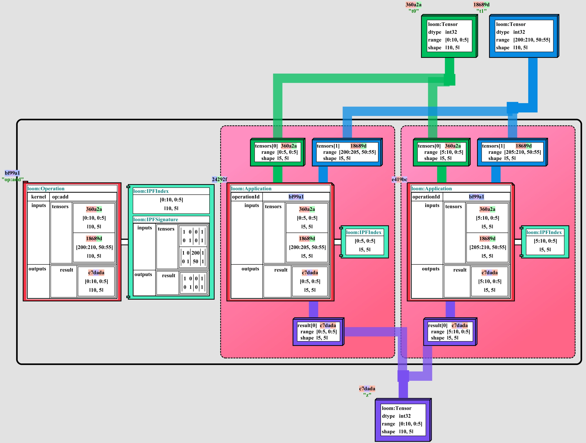

# Dialects

Tapestry is structured with a modular graph system.

A given graph is attached to a _LoomEnvironment_, which defines the legal node and tag types used in
the graph; along with a collection of constraints and rules for the graph.

In this way, dialects focused on different aspects of the tool chain can be developed and remain
strictly defined, while sharing common scan and validation tooling.

## Operation Expression Dialect

The [Operation Expression Dialect](OperationExpressionDialect.md) is a dialect for representing
un-sharded operations and tensors in a graph.

## Application Expression Dialect

The [Application Expression Dialect](ApplicationExpressionDialect.md) is a dialect for representing
application sharded operations and tensors in a graph.

It extends the [Operation Expression Dialect](OperationExpressionDialect.md) to include Application
shards, and constraints for application sharded operations.

