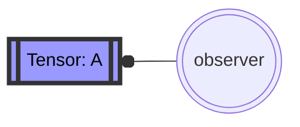
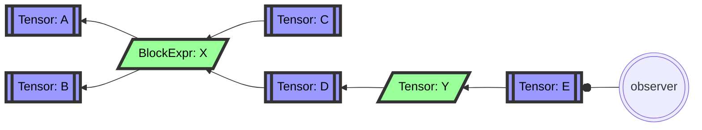
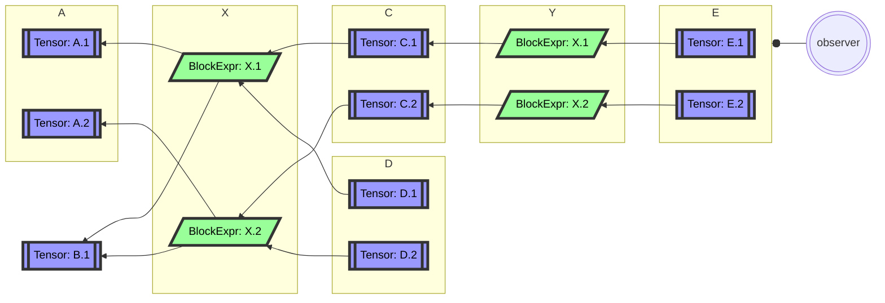
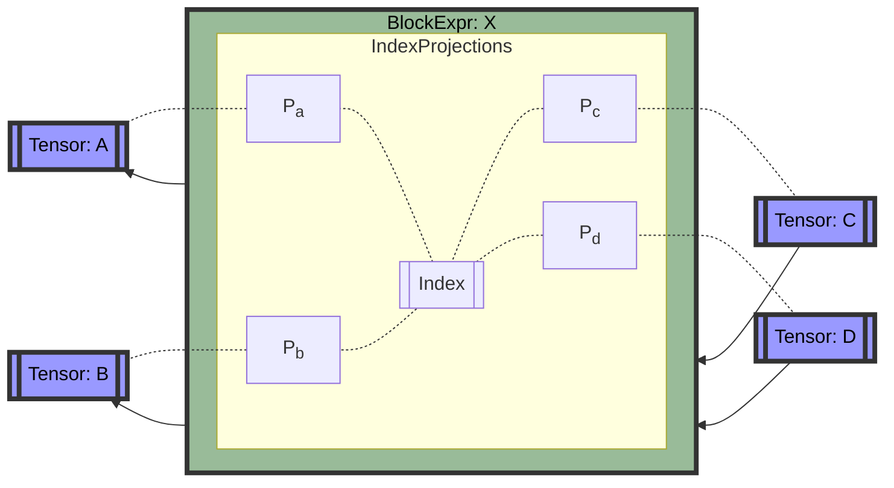
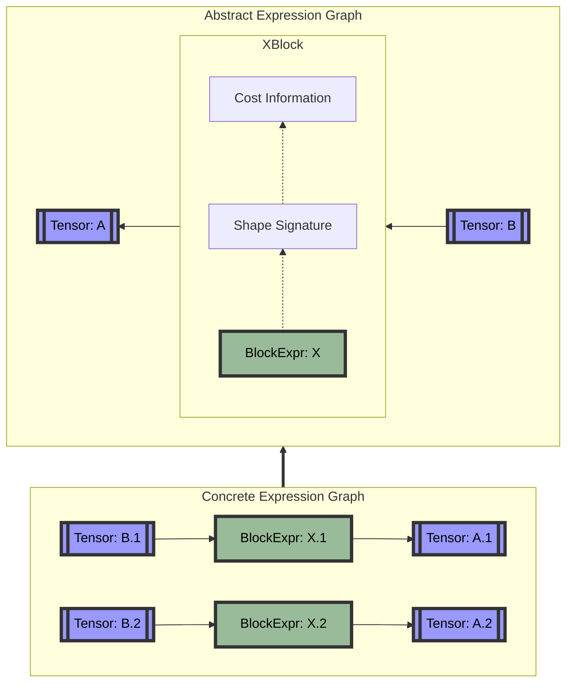

# Notes towards an Expression Language

This is a demo implementation of the ideas in [Tapestry](htttps://github.com/loom-ai/tapestry),
which is much more verbose than this stack.

These notes exist to help me argue through the object hierarchy; not to document correct usage.

Expression languages differ from process languages in that define values in terms of
transformations on previous values. The simplest outcome of this is that it's quite
easy to use a given value more than once; but by adding an observer, we can define
directly which values are ever observed by the outside world.

Values which are never observed are free to be inlined (when they contribute to other
values which transitively are observed), or even eliminated entirely (when they don't
contribute to any observed values).

### Simple Expressions

So the simplest non-trivial tensor expression is a tensor which is observed directly:

What does it mean for us to be able to observe a tensor value?

* After the expression is evaluated, we can read the value of the tensor.

### Chained Expressions

We're generaly interested in more complex expressions, where transformations are applied to
tensor values, and then to the results of those transformations, and so on.

In this example, the *Tensor: C* value is never observed, and so it can dropped entirely
from our schedule, or generated and *written* to a null-store by the block expr.

We are operating with a contract that if we provide the data in `A` and `B` to `X`;
that it will correctly produce `C` and `D` for us; and that this operation is idempotent.

Additionally, at this level it's quite possible that the tensors are abstractions
which could not fit on a single machine.

### Sharded Expressions

We are interested in the ability to:

* shard these operations and values;
* execute a given sharded schedule;
* and to compare the costs (in time and space) of different sharding choices.

This continues the assertion that this is an equivalent and correct sharding;
that each of the operations, if performed in dependency order, will produce the same
result as the original expression.

### Polyhedral Type Information

Being able to say:

* Expression `X'` is a sharded version of expression `X`

Is independent of our ability to:

* Verify that `X'` is a sharded version of `X`; or
* Given `X`, generate shareded versions `X'` and `X''`

If we have an execution environment for `X'`; having the sharded version is sufficient
for execution.

* Being able to describe the relative components in a tractable maner is the main project.

The additional information, needed to verify and generate sharded versions, is
the polyhedral type signature information attached to the expressions.

This is discussed in great detail in [Tapestry](htttps://github.com/loom-ai/tapestry),
and part of the point of this repository is to explore ways to structure data ownership
to describe the abstract graphs, the polyhedral type information, and the concrete
sharded graphs in a way which enables us to:

* Verify that the sharded graphs are correct;
* Generate sharded graphs from the abstract graphs;
* Generate abstract graphs from the sharded graphs;
* Apply a cost model to the sharded graphs;
* Write a stochastic optimizer to find good sharding choices.

In this diagram, we've added the *Expression Index Space* and the *Index Projection Functions
(<code>Pa</code>) to the information present in the block expression.

This information is necessary to make any changes to the sharding of the expressions; though it
is not necessary to schedule or execute a correct sharding as-is.

Additionally, there's annotation information we could include or derive, such as:

* the expected size of the input / output tensors
    * when married with a concrete execution schedule, this permits transmission bandwith/delay modeling.
* the expected compute costs of the block
    * CPU/GPU delay
    * Block memory usage

This information about blocks, describing the cost models, is needed in most places where the
polyhedral type information is needed.

### The cost information

As a consequence of the choice of index spaces and index projection functions for the
*Tapestry* expression representations; we can show that the marginal data sharing
costs for input and output have constant marginal costs along each dimension of
the index space; e.g. the marginal cost change of including one additional step along a
batch dimension is constant, though different, than taking one additional step along
a channel dimension.

As the block compute model assumes shardable blocks which are location agnostic in
slice space; *Assuming* that the marginal compute/memory costs of blocks is linearly
related to their inputs along the above dimensions; we can take as an abstrac cost model the
notion of marginal resource cost per step along each dimension of the index space.

Additionally, at this layer we don't know what to *do* with those costs, that is a function
of the cost model / scheduling simulator (how are parallel costs managed? are transmission/bandwidth
costs elided when a tensor is being moved to the same machine it's already on; etc.);
so we can model costs as fixed marginal costs per step along each dimension of the index space;
for each of an arbitrary number of inputs.

Given an index space `I` with dimensions `batch, x, y, k`;

|       | gpu | ram |
|-------|-----|-----|
| batch | 1   | 1   |
| x     | 4   | 8   |
| y     | 4   | 8   |
| k     | 128 | 64  |

We also assume that the transmission of tensors is well modeled,
and that the marginal costs associated with the tensors is borne
entirely by the marginal data overlap and the transmissions costs.

Additionally, multiple sharded expressions can share the same shape
and cost information (as well as information about the operation being modeled)
