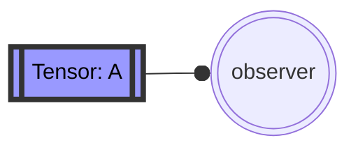
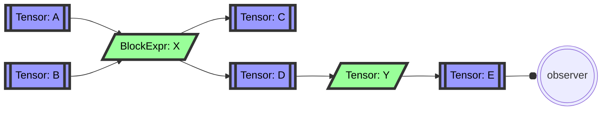
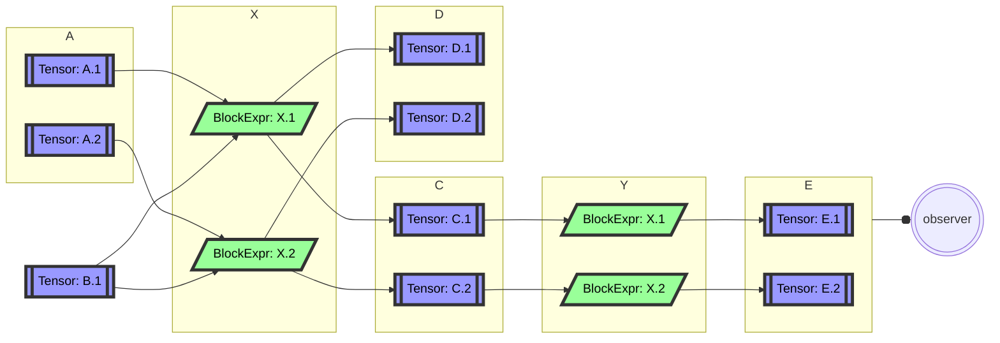

# Notes towards an Expression Language

This is a demo implementation of the ideas in [Tapestry](htttps://github.com/loom-ai/tapestry),
which is much more verbose than this stack.

These notes exist to help me argue through the object hierarchy; not to document correct usage.

Expression languages differ from process languages in that define values in terms of
transformations on previous values. The simplest outcome of this is that it's quite
easy to use a given value more than once; but by adding an observer, we can define
directly which values are ever observed by the outside world.

Values which are never observed are free to be inlined (when they contribute to other
values which transitively are observed), or even eliminated entirely (when they don't
contribute to any observed values).

So the simplest non-trivial tensor expression is a tensor which is observed directly:

What does it mean for us to be able to observe a tensor value?

* After the expression is evaluated, we can read the value of the tensor.

We're generaly interested in more complex expressions, where transformations are applied to
tensor values, and then to the results of those transformations, and so on.

In this example, the *Tensor: C* value is never observed, and so it can dropped entirely
from our schedule, or generated and *written* to a null-store by the block expr.

Additionally, at this level it's quite possible that the tensors, and the inputs the *BlockExpr*
abstractions which could not fit on a single machine.

We are interested in the ability to:

* shard these operations and values;
* execute a given sharded schedule;
* and to compare the costs (in time and space) of different sharding choices.

