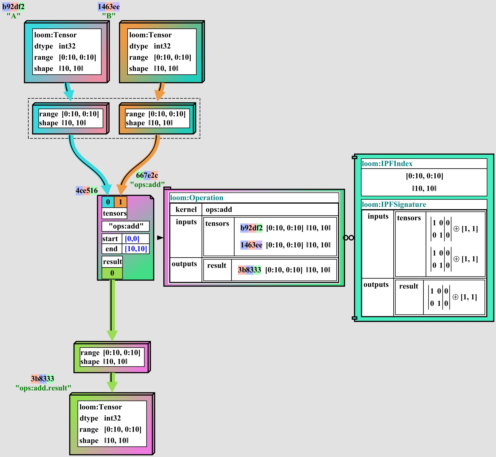

# Tapestry Loom

**Loom** is a **Tapestry** module which provides an extensible api for representing and manipulating
static tensor block operation expression graphs.

The rewriting and optimization of static graphs is the primary purpose of **Tapestry**. Semantics
preserving static graph rewrites are the primary mechanism for implementing optimizers; as we can
pair a library of rewrite transforms with a cost model to search for better graphs for a target cost
model.

Consider the following graph adding two tensors:



This graph would serialize to the following JSON (ignoring the IPF components for now):

```json
{
  "nodes": [
    {
      "id": "f3e3e3e3-3e3e-3e3e-3e3e-3e3e3e3e3e3e",
      "type": "loom:Tensor",
      "label": "A",
      "body": {
        "range": {
          "start": [0, 0],
          "end": [10, 10]
        },
        "dtype": "float32"
      }
    },
    {
      "id": "f3e3e3e3-3e3e-3e3e-3e3e-3e3e3e3e3e3f",
      "type": "loom:Tensor",
      "label": "B",
      "body": {
        "range": {
          "start": [0, 0],
          "end": [10, 10]
        },
        "dtype": "float32"
      }
    },
    {
      "id": "f3e3e3e3-3e3e-3e3e-3e3e-3e3e3e3e3e00",
      "type": "loom:Tensor",
      "label": "C",
      "body": {
        "range": {
          "start": [0, 0],
          "end": [10, 10]
        },
        "dtype": "float32"
      }
    },
    {
      "id": "f3e3e3e3-3e3e-3e3e-3e3e-3e3e3e3e3e01",
      "type": "loom:Operation",
      "label": "ops:add",
      "body": {
        "kernel": "ops:add",
        "inputs": {
          "tensors": [
            {
              "tensorId": "f3e3e3e3-3e3e-3e3e-3e3e-3e3e3e3e3e3e",
              "range": {
                "start": [0, 0],
                "end": [10, 10]
              }
            },
            {
              "tensorId": "f3e3e3e3-3e3e-3e3e-3e3e-3e3e3e3e3e3f",
              "range": {
                "start": [0, 0],
                "end": [10, 10]
              }
            }
          ]
        },
        "outputs": {
          "result": [
            {
              "tensorId": "f3e3e3e3-3e3e-3e3e-3e3e-3e3e3e3e3e00",
              "range": {
                "start": [0, 0],
                "end": [10, 10]
              }
            }
          ]
        }
      }
    }
  ]
}
```

## Loom Graphs

A [LoomGraph](src/main/java/org/tensortapestry/loom/graph/LoomGraph.java) is a collection of
[LoomNode](src/main/java/org/tensortapestry/loom/graph/LoomNode.java)s.

The types of nodes and annotations are defined by URI strings; and paired (in a given
[LoomEnvironment](src/main/java/org/tensortapestry/loom/graph/LoomEnvironment.java) with type-aware
validators and serializers.

> **NOTE**: the URI structure of types is in flux; it is currently a URL to a JSD schema, but this
> is likely to change and be replaced with a more abstract URI scheme, to permit multiple type
> resources to decorate the same type.

While it is possible to parse a graph in a permissive **LoomEnvironment** with no type validation,
and formatting and query tools may wish to do so; the primary use case for **Loom** is to construct
environments which require strict type validation of all components which appear in a given graph.

A **LoomEnvironment** is decorated with a collection of validators, which can walk the graph and
check the validity of node and annotation types; but can also enforce more complex constraints such
as the agreement of tensor shapes and dtypes between nodes; the presence of required annotations;
the lack of cycles in the graph; and so on.

A given dialect of **Loom** may have a different set of validators, and may have a different set of
annotations and node types.

## Extensible Dialects

The role of extensible dialects in the graph is _partially_ to provide a way to extend the graph
with additional types and annotations for new research; but _primarily_ to provide a way to describe
the constraints and placement primitives for a target cost model / execution environment pair.

Targeting optimization for the single-GPU case is different from targeting optimization for the
distributed multi-GPU case; the later requires placement and transfer primitives which are not
present in the former. More exotic targets, such as generating FPGA or HDL code, or targeting Onyx
environments, would bring their own constraints and primitives.

By permitting extension dialects, the goal is to permit the optimizer to be written in a way which
is agnostic to the target environment; and to permit the target environment to be written in a way
which is agnostic to the optimizer.

## Polyhedral Type Theory Sharding

The primary dialect of **Loom** is a tensor operation dialect with support for **Polyhedral Type
Theory** operation signature descriptions.

This is a representation of operations which describes an intrinsic index space for each operation,
and maps that index space to the index spaces of the input and output tensors through affine index
space transformations.

Consider the following example graph, where a `matmul` operation is followed by a `row_sum`
operation; but the operations are sharded into sub-block applications.

Note that the shape of each shard's selection of input and output tensors is derived from the
shard's slice of the operation's index space; projected through the operation's ipf signature's
affine transformations.


